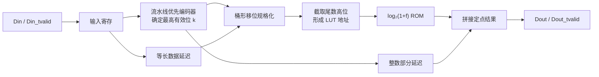

**简体中文** | [English](./Log2_LUT_EN.md)

# 基于查找表的 FPGA 定点 log₂ 计算模块设计

在 FPGA 频谱处理中，FFT 输出通常还需要经过模值平方、对数压缩和标度换算，才能得到便于显示和比较的功率谱。与线性功率相比，对数功率能够压缩动态范围，也更接近常用的 dB 表示形式。

直接在 FPGA 中实现通用对数运算代价较高。本文介绍一种适合流式数据处理的定点 `log₂` 模块：先通过流水线优先编码器确定输入数据的最高有效位，得到对数的整数部分；再将输入规格化，从规格化尾数中截取高位作为 ROM 地址，查表得到小数部分。该结构不使用乘法器，连续输入时可实现每个时钟周期处理一个数据，适合接在功率计算模块之后完成对数压缩。

## 1. 功率谱为什么需要对数运算

FFT 第 $k$ 个频点的复数输出可写为：

$$
X[k] = I[k] + jQ[k]
$$

对应的线性功率为：

$$
P[k] = I[k]^2 + Q[k]^2
$$

功率的 dB 表示为：

$$
P_{\mathrm{dB}}[k] = 10\log_{10}P[k]
$$

二进制对数更容易映射到数字硬件。利用换底公式：

$$
10\log_{10}P = 10\log_{10}2\cdot\log_2P
$$

其中：

$$
10\log_{10}2 \approx 3.0103
$$

因此，模块先计算 $\log_2P$，后级再乘以常数 `3.0103`，即可得到功率的 dB 值。如果输入是幅度而不是功率，则使用：

$$
20\log_{10}A \approx 6.0206\log_2A
$$

需要注意，FFT 缩放、窗函数增益、定点小数位以及参考功率都会引入固定偏移。实际系统通常还要在对数结果后增加一个校正常数，才能得到 dBFS、dBm 等具有明确参考基准的数值。

## 2. log₂ 的硬件分解

对于任意正整数输入 $x$，都可以写成：

$$
x = 2^k\cdot m,\qquad 1\leq m<2
$$

其中，$k$ 是最高有效位的位置，$m$ 是规格化尾数。于是：

$$
\log_2x = k + \log_2m
$$

进一步令：

$$
m = 1+f,\qquad 0\leq f<1
$$

可得：

$$
\log_2x = k + \log_2(1+f)
$$

这样，完整的对数运算就被拆成了两个部分：

- 通过最高有效位位置直接得到整数部分 $k$；
- 在固定区间 $[1,2)$ 内对 $\log_2(1+f)$ 查表，得到小数部分。

与直接实现对数迭代相比，这种方法结构清晰、吞吐率高，代价主要是优先编码逻辑和一块 ROM。

## 3. FPGA 总体结构



模块由 `log2.v`、`Priencr.v`、`shiftreg.v` 和 `rams_rom.v` 四部分组成。`log2.v` 负责各级数据对齐和结果拼接，其余模块分别完成最高有效位检测、数据延迟和同步 ROM 查表。

### 3.1 流水线优先编码器

`Priencr` 用于寻找输入数据中最高的 `1`，其输出 `Pos` 就是：

$$
k=\left\lfloor\log_2x\right\rfloor
$$

为了避免用一个很长的组合优先级链，代码先将输入位宽补齐到 $2^n$，再采用逐级二分的方式搜索。每一级判断当前数据的高半区是否存在 `1`：

- 高半区非零时，记录当前位置位为 `1`，下一拍继续搜索高半区；
- 高半区为零时，记录当前位置位为 `0`，下一拍继续搜索低半区。

若输入位宽为 `IN_DATA_WIDTH`，编码器级数为：

$$
N_{stage}=\left\lceil\log_2(\text{IN\_DATA\_WIDTH})\right\rceil
$$

例如输入位宽为 29 或 32 bit 时，编码器都需要 5 级。各级之间均插入寄存器，因此连续数据可以做到一拍一输入。

### 3.2 数据对齐与规格化

优先编码器存在多拍延迟，因此原始输入同时经过 `shiftreg` 延迟，使数据与最高有效位位置在桶形移位级重新对齐。

规格化操作为：

```verilog
Data_Barrel <= Data_Pipe << (IN_DATA_WIDTH - 1 - Integer);
```

移位后，原始数据最高位的 `1` 被移动到 `Data_Barrel[IN_DATA_WIDTH-1]`。此时数据可视为：

$$
1.f_{IN\_DATA\_WIDTH-2}\ldots f_1f_0
$$

最高位固定为整数位 `1`，其后的比特表示规格化尾数的小数部分。代码截取最高的 `LUT_PRECISION` 个小数位作为 ROM 地址：

```verilog
Data_Barrel[IN_DATA_WIDTH-2-:LUT_PRECISION]
```

因此必须满足：

$$
\text{LUT\_PRECISION}\leq\text{IN\_DATA\_WIDTH}-1
$$

### 3.3 小数部分查找表

ROM 深度由地址位宽决定：

$$
DEPTH=2^{\text{LUT\_PRECISION}}
$$

对于地址 $a$，ROM 中保存：

$$
LUT[a]=\operatorname{round}\left(\log_2\left(1+\frac{a}{2^{P}}\right)\cdot2^F\right)
$$

其中，$P$ 为 `LUT_PRECISION`，$F$ 为 `OUT_FRAC_WIDTH`。当舍入结果达到 $2^F$ 时，脚本将其饱和为 $2^F-1$，保证数据能够装入 `F` bit ROM。

项目中的 MATLAB 脚本 `Log2_Frac_Init.m` 用于生成十六进制初始化文件：

```matlab
for addr = 0 : DEPTH-1
    frac_in = addr / DEPTH;
    log2_frac = log2(1 + frac_in);
    lut_data = round(log2_frac * SCALE);

    if lut_data >= SCALE
        lut_data = SCALE - 1;
    end

    fprintf(fid, '%04X\n', lut_data);
end
```

默认配置 `LUT_PRECISION=16`、`OUT_FRAC_WIDTH=16` 时，ROM 规模为 `65536 × 16 bit`，总容量约为 1 Mibit。代码添加了 `(* rom_style = "block" *)` 属性，提示 Vivado 优先使用 Block RAM 实现；实际 BRAM 数量还会受到器件结构和综合映射方式影响。

### 3.4 输出定点格式

最终结果直接拼接整数部分和查表得到的小数部分：

```verilog
Result <= {Integer_Out_1, Fraction};
```

输出是无符号定点数，可表示为：

$$
Q\text{OUT\_INT\_WIDTH}.\text{OUT\_FRAC\_WIDTH}
$$

其实际数值为：

$$
\log_2x\approx Integer+\frac{Fraction}{2^{\text{OUT\_FRAC\_WIDTH}}}
$$

默认 32 bit 输入时，`OUT_INT_WIDTH=5`、`OUT_FRAC_WIDTH=16`，所以 `Dout` 为 21 bit 的无符号定点数。29 bit 输入的 testbench 同样得到 5 bit 整数部分和 16 bit 小数部分。

## 4. 接口时序与流水线延迟

模块采用类似 AXI-Stream 的 `valid + data` 接口，但没有 `ready` 信号：

- `Din_tvalid=1` 时，模块在当前上升沿接收 `Din`；
- `Dout_tvalid=1` 时，`Dout` 才是有效结果；
- 模块没有反压能力，后级必须能够接收所有有效输出；
- 流水线填满后支持每拍输入、每拍输出一个数据。

按当前 RTL 的有效信号链路统计，从输入数据被模块接收到对应 `Dout_tvalid` 拉高，延迟为：

$$
LATENCY=\text{OUT\_INT\_WIDTH}+4
$$

因此 29 bit 和 32 bit 输入配置的 `OUT_INT_WIDTH` 都为 5，对应总延迟均为 9 个时钟周期。系统集成时应使用 `Dout_tvalid` 对齐频点索引、帧标志等旁路信息，不建议只依靠固定拍数硬编码对齐关系。

## 5. 参数与精度权衡

| 参数 | 含义 | 默认值 |
| --- | --- | ---: |
| `IN_DATA_WIDTH` | 无符号输入数据位宽 | 32 |
| `OUT_INT_WIDTH` | 输出整数部分位宽 | `clog2(IN_DATA_WIDTH)` |
| `LUT_PRECISION` | ROM 地址位宽、尾数取样精度 | 16 |
| `OUT_FRAC_WIDTH` | 输出小数位宽、ROM 数据位宽 | 16 |
| `OUT_DATA_WIDTH` | 输出总位宽 | 两部分之和 |

`LUT_PRECISION` 每增加 1 bit，ROM 深度都会翻倍；`OUT_FRAC_WIDTH` 增加则会线性增加 ROM 数据位宽。两者作用不同：

- `LUT_PRECISION` 决定对规格化尾数的取样间隔，主要影响输入量化误差；
- `OUT_FRAC_WIDTH` 决定查表结果的量化粒度，主要影响输出量化误差。

当前地址采用直接截断，没有对被舍弃的尾数低位进行四舍五入，因此近似值会叠加尾数截断误差和 ROM 输出量化误差。16 bit 地址和 16 bit 输出小数通常已经能够提供较高精度，但也会使用较多 BRAM。若应用只用于频谱显示或门限检测，可以评估将地址位宽缩短到 10～12 bit，以换取明显的存储资源下降。

## 6. 仿真验证方法

工程中的 `tb_log2.v` 使用 29 bit 输入，复位结束后令 `Din` 连续递增，并通过 `Din_tvalid` 持续送入模块。仿真前需要先运行 MATLAB 脚本生成 `Log2_Frac_Init.mem`，并确保 Vivado 仿真工作目录能够找到该文件。

验证时可以选取以下边界数据：

| 输入 `Din` | 理论值 `log₂(Din)` | 预期特征 |
| ---: | ---: | --- |
| 1 | 0 | 整数和小数部分均为 0 |
| 2 | 1 | 整数部分为 1，小数部分为 0 |
| 3 | 1.5849625 | 整数部分为 1，小数部分约为 0.58496 |
| 4 | 2 | 整数部分为 2，小数部分为 0 |
| 8 | 3 | 整数部分为 3，小数部分为 0 |

使用与 RTL 相同的规格化、地址截取和 Q16 量化规则建立软件参考模型，可得到：

| 输入 `Din` | RTL 定点值 | 数学参考值 | 误差 |
| ---: | ---: | ---: | ---: |
| 3 | 1.58496094 | 1.58496250 | -1.56×10⁻⁶ |
| 10 | 3.32192993 | 3.32192809 | +1.84×10⁻⁶ |
| $2^{29}-1$ | 28.99998474 | 29.00000000 | -1.53×10⁻⁵ |

对输入 `1～1,000,000` 进行穷举比较时，软件模型得到的最大绝对误差约为 `2.68×10⁻⁵`，平均绝对误差约为 `6.75×10⁻⁶`。该结果用于核对当前 16 bit 地址、16 bit 小数输出配置的算法量化行为；最终工程结果仍应以目标器件上的 RTL 仿真和实现报告为准。

除观察数值外，还应重点检查：

1. 连续输入时，输出是否在固定延迟后保持连续；
2. `Dout_tvalid` 是否与对应输入数据严格对齐；
3. 在 $2^n-1$、$2^n$、$2^n+1$ 附近，整数部分是否正确跳变；
4. 改变 `LUT_PRECISION` 或 `OUT_FRAC_WIDTH` 后，初始化文件的深度和数据位宽是否同步修改。

## 7. 接入功率谱处理链

典型的 FPGA 功率谱处理链可以组织为：


常数 `3.0103` 可以使用定点常数乘法实现，综合工具通常会将其映射为 DSP 或移位加法结构。若只需要相对频谱，也可以保留 `log₂` 标度，不立即换算为十进制 dB；频点之间的相对强弱关系不会改变。

## 8. 工程注意事项

### 8.1 输入必须是正数

数学上 $\log_2(0)$ 无定义。当前 RTL 对全零输入会得到 `0`，这只是编码器和 ROM 的自然输出，并不代表数学结果。功率谱中可能出现零功率频点，建议在模块前增加钳位：

```verilog
wire [IN_DATA_WIDTH-1:0] log2_din = (power == 0) ? 1 : power;
```

也可以钳位到系统定义的最小噪声功率，并在后级映射到显示下限。

### 8.2 初始化文件路径

`rams_rom.v` 通过 `$readmemh(INIT_FILE, ram)` 载入 ROM。`INIT_FILE` 使用相对路径时，仿真器和综合工具必须能在各自的工作目录中找到文件。建议将 `.mem` 文件加入 Vivado 工程，并设置为 Memory Initialization Files，避免仿真正常但综合后 ROM 未正确初始化。

### 8.3 参数必须成组修改

MATLAB 脚本中的 `ADDR_WIDTH` 应与 `LUT_PRECISION` 一致，`DATA_WIDTH` 应与 `OUT_FRAC_WIDTH` 一致。若只修改 RTL 参数而没有重新生成初始化文件，ROM 深度或每行数据位宽就会不匹配。

### 8.4 输入和输出均为无符号数

该模块面向正的幅度或功率数据，不能直接处理有符号输入。若前级采用带小数位的定点功率格式，还需要在最终结果中减去输入定点缩放带来的 $F\log_2 2=F$ 偏移。

## 9. 工程源码

- [`log2.v`](./Code/Vivado/log2.v)：顶层对数模块；
- [`tb_log2.v`](./Code/Vivado/tb_log2.v)：对数模块 testbench；
- [`Priencr.v`](./Code/Vivado/Priencr.v)：流水线优先编码器；
- [`tb_Priencr.v`](./Code/Vivado/tb_Priencr.v)：优先编码器 testbench；
- [`shiftreg.v`](./Code/Vivado/shiftreg.v)：原始输入对齐延迟；
- [`rams_rom.v`](./Code/Vivado/rams_rom.v)：同步查找表 ROM；
- [`Log2_Frac_Init.m`](./Code/MATLAB/Log2_Frac_Init.m)：ROM 初始化文件生成脚本。

运行 RTL 仿真前，应先执行 MATLAB 脚本生成 `Log2_Frac_Init.mem`，再将生成的初始化文件加入 Vivado 工程或放到仿真器可访问的工作目录。

## 10. 总结

该 `log₂` 模块利用“最高有效位 + 规格化尾数查表”完成定点对数计算。整数部分由流水线优先编码器获得，小数部分通过 Block RAM 查表获得，在避免通用对数迭代和乘法运算的同时，实现了固定延迟和一拍一个数据的吞吐率。

这类结构很适合功率谱显示、信号检测和动态范围压缩。实际使用时，需要根据精度与 BRAM 资源选择合适的查表位宽，并特别处理零输入、ROM 初始化路径、定点缩放偏移以及旁路信息的流水线对齐。
