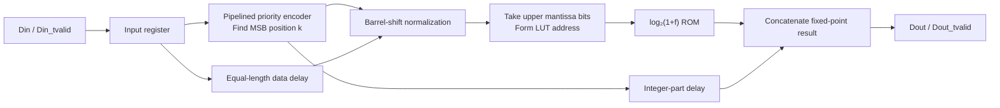
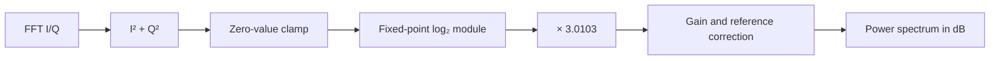

[简体中文](./Log2_LUT.md) | **English**

# Design of a Lookup-Table-Based FPGA Fixed-Point log₂ Module

In FPGA spectrum processing, the FFT output usually needs to undergo magnitude-squared calculation, logarithmic compression, and scaling conversion before a power spectrum suitable for display and comparison can be obtained. Compared with linear power, logarithmic power compresses the dynamic range and is also closer to the commonly used dB representation.

Implementing a general-purpose logarithm directly in an FPGA is costly. This article presents a fixed-point `log₂` module suitable for streaming data processing. A pipelined priority encoder first determines the most significant set bit of the input data to obtain the integer part of the logarithm. The input is then normalized, and the upper bits of the normalized mantissa are used as a ROM address to look up the fractional part. This architecture uses no multipliers and, with continuous input, can process one sample per clock cycle. It is therefore well suited for logarithmic compression after a power-calculation module.

## 1. Why a Power Spectrum Needs a Logarithm

The complex output of the FFT at frequency bin $k$ can be written as:

$$
X[k] = I[k] + jQ[k]
$$

The corresponding linear power is:

$$
P[k] = I[k]^2 + Q[k]^2
$$

The power in dB is:

$$
P_{\mathrm{dB}}[k] = 10\log_{10}P[k]
$$

A binary logarithm maps more naturally to digital hardware. Using the change-of-base formula:

$$
10\log_{10}P = 10\log_{10}2\cdot\log_2P
$$

where:

$$
10\log_{10}2 \approx 3.0103
$$

The module can therefore first calculate $\log_2P$, after which a downstream stage multiplies the result by the constant `3.0103` to obtain power in dB. If the input is amplitude rather than power, use:

$$
20\log_{10}A \approx 6.0206\log_2A
$$

Note that FFT scaling, window gain, fixed-point fractional bits, and reference power all introduce fixed offsets. In a practical system, a correction constant is usually added after the logarithmic result to obtain values with a defined reference, such as dBFS or dBm.

## 2. Hardware Decomposition of log₂

Any positive integer input $x$ can be written as:

$$
x = 2^k\cdot m,\qquad 1\leq m<2
$$

Here, $k$ is the position of the most significant set bit, and $m$ is the normalized mantissa. Therefore:

$$
\log_2x = k + \log_2m
$$

Furthermore, let:

$$
m = 1+f,\qquad 0\leq f<1
$$

Then:

$$
\log_2x = k + \log_2(1+f)
$$

The complete logarithm is thus divided into two parts:

- Obtain the integer part $k$ directly from the position of the most significant set bit.
- Look up $\log_2(1+f)$ over the fixed interval $[1,2)$ to obtain the fractional part.

Compared with implementing an iterative logarithm directly, this method has a clear structure and high throughput. Its main costs are the priority-encoding logic and one ROM.

## 3. Overall FPGA Architecture



The module consists of four parts: `log2.v`, `Priencr.v`, `shiftreg.v`, and `rams_rom.v`. `log2.v` aligns data across the pipeline stages and concatenates the final result, while the other modules respectively detect the most significant set bit, delay the data, and perform a synchronous ROM lookup.

### 3.1 Pipelined Priority Encoder

`Priencr` finds the highest `1` in the input data. Its output `Pos` is:

$$
k=\left\lfloor\log_2x\right\rfloor
$$

To avoid a long combinational priority chain, the code first pads the input width to $2^n$ and then searches by successive binary partitioning. At each stage, it checks whether the upper half of the current data contains a `1`:

- If the upper half is nonzero, the current position bit is recorded as `1`, and the next stage continues searching the upper half.
- If the upper half is zero, the current position bit is recorded as `0`, and the next stage continues searching the lower half.

For an input width of `IN_DATA_WIDTH`, the number of encoder stages is:

$$
N_{stage}=\left\lceil\log_2(\text{IN\_DATA\_WIDTH})\right\rceil
$$

For example, both 29-bit and 32-bit inputs require five stages. Registers are inserted between all stages, allowing one new input on every clock cycle.

### 3.2 Data Alignment and Normalization

Because the priority encoder introduces a multi-cycle delay, the original input passes through `shiftreg` at the same time so that the data and the most significant bit position are realigned at the barrel-shift stage.

The normalization operation is:

```verilog
Data_Barrel <= Data_Pipe << (IN_DATA_WIDTH - 1 - Integer);
```

After the shift, the highest `1` of the original data is moved to `Data_Barrel[IN_DATA_WIDTH-1]`. The data can now be viewed as:

$$
1.f_{IN\_DATA\_WIDTH-2}\ldots f_1f_0
$$

The most significant bit is the fixed integer bit `1`, and the following bits represent the fractional part of the normalized mantissa. The code takes the uppermost `LUT_PRECISION` fractional bits as the ROM address:

```verilog
Data_Barrel[IN_DATA_WIDTH-2-:LUT_PRECISION]
```

Therefore, the following condition must be satisfied:

$$
\text{LUT\_PRECISION}\leq\text{IN\_DATA\_WIDTH}-1
$$

### 3.3 Fractional-Part Lookup Table

The ROM depth is determined by the address width:

$$
DEPTH=2^{\text{LUT\_PRECISION}}
$$

For address $a$, the ROM stores:

$$
LUT[a]=\operatorname{round}\left(\log_2\left(1+\frac{a}{2^{P}}\right)\cdot2^F\right)
$$

Here, $P$ is `LUT_PRECISION`, and $F$ is `OUT_FRAC_WIDTH`. If the rounded result reaches $2^F$, the script saturates it to $2^F-1$ so that the value fits in an `F`-bit ROM.

The MATLAB script `Log2_Frac_Init.m` in the project generates the hexadecimal initialization file:

```matlab
for addr = 0 : DEPTH-1
    frac_in = addr / DEPTH;
    log2_frac = log2(1 + frac_in);
    lut_data = round(log2_frac * SCALE);

    if lut_data >= SCALE
        lut_data = SCALE - 1;
    end

    fprintf(fid, '%04X\n', lut_data);
end
```

With the default settings `LUT_PRECISION=16` and `OUT_FRAC_WIDTH=16`, the ROM size is `65536 × 16 bit`, for a total capacity of approximately 1 Mibit. The code adds the `(* rom_style = "block" *)` attribute to suggest that Vivado implement the ROM using Block RAM. The actual BRAM count also depends on the target device architecture and synthesis mapping.

### 3.4 Output Fixed-Point Format

The final result directly concatenates the integer part and the fractional part from the lookup table:

```verilog
Result <= {Integer_Out_1, Fraction};
```

The output is an unsigned fixed-point number represented as:

$$
Q\text{OUT\_INT\_WIDTH}.\text{OUT\_FRAC\_WIDTH}
$$

Its actual value is:

$$
\log_2x\approx Integer+\frac{Fraction}{2^{\text{OUT\_FRAC\_WIDTH}}}
$$

With the default 32-bit input, `OUT_INT_WIDTH=5` and `OUT_FRAC_WIDTH=16`, so `Dout` is a 21-bit unsigned fixed-point number. The 29-bit input used by the testbench likewise produces a 5-bit integer part and a 16-bit fractional part.

## 4. Interface Timing and Pipeline Latency

The module uses a `valid + data` interface similar to AXI-Stream, but it has no `ready` signal:

- When `Din_tvalid=1`, the module accepts `Din` on the current rising edge.
- When `Dout_tvalid=1`, `Dout` contains a valid result.
- The module cannot apply backpressure, so the downstream stage must accept every valid output.
- Once the pipeline is full, the module supports one input and one output per clock cycle.

Counting the valid-signal path in the current RTL, the latency from accepting an input sample to asserting the corresponding `Dout_tvalid` is:

$$
LATENCY=\text{OUT\_INT\_WIDTH}+4
$$

For both the 29-bit and 32-bit input configurations, `OUT_INT_WIDTH` is 5, giving a total latency of nine clock cycles. During system integration, `Dout_tvalid` should be used to align sideband information such as the frequency-bin index and frame markers. Hard-coding alignment solely by a fixed cycle count is not recommended.

## 5. Parameter and Precision Trade-Offs

| Parameter | Meaning | Default |
| --- | --- | ---: |
| `IN_DATA_WIDTH` | Unsigned input data width | 32 |
| `OUT_INT_WIDTH` | Width of the output integer part | `clog2(IN_DATA_WIDTH)` |
| `LUT_PRECISION` | ROM address width and mantissa sampling precision | 16 |
| `OUT_FRAC_WIDTH` | Output fractional width and ROM data width | 16 |
| `OUT_DATA_WIDTH` | Total output width | Sum of the two parts |

Each additional bit of `LUT_PRECISION` doubles the ROM depth, while increasing `OUT_FRAC_WIDTH` increases the ROM data width linearly. They serve different purposes:

- `LUT_PRECISION` determines the sampling interval of the normalized mantissa and mainly affects input quantization error.
- `OUT_FRAC_WIDTH` determines the quantization step of the lookup result and mainly affects output quantization error.

The current address is obtained by direct truncation, without rounding the discarded lower mantissa bits. The approximation error therefore combines mantissa-truncation error and ROM-output quantization error. A 16-bit address and a 16-bit fractional output usually provide high precision, but they also consume substantial BRAM. If the application only needs spectrum display or threshold detection, an address width of 10 to 12 bits can be evaluated in exchange for a significant reduction in memory resources.

## 6. Simulation Verification Method

The `tb_log2.v` in the project uses a 29-bit input. After reset is released, it continuously increments `Din` and drives samples into the module with `Din_tvalid` asserted. Before simulation, run the MATLAB script to generate `Log2_Frac_Init.mem`, and ensure that the Vivado simulation working directory can locate the file.

The following boundary values can be selected for verification:

| Input `Din` | Theoretical `log₂(Din)` | Expected characteristic |
| ---: | ---: | --- |
| 1 | 0 | Both the integer and fractional parts are 0 |
| 2 | 1 | The integer part is 1 and the fractional part is 0 |
| 3 | 1.5849625 | The integer part is 1 and the fractional part is approximately 0.58496 |
| 4 | 2 | The integer part is 2 and the fractional part is 0 |
| 8 | 3 | The integer part is 3 and the fractional part is 0 |

A software reference model using the same normalization, address truncation, and Q16 quantization rules as the RTL gives:

| Input `Din` | RTL fixed-point value | Mathematical reference | Error |
| ---: | ---: | ---: | ---: |
| 3 | 1.58496094 | 1.58496250 | -1.56×10⁻⁶ |
| 10 | 3.32192993 | 3.32192809 | +1.84×10⁻⁶ |
| $2^{29}-1$ | 28.99998474 | 29.00000000 | -1.53×10⁻⁵ |

For an exhaustive comparison over inputs `1～1,000,000`, the software model produces a maximum absolute error of approximately `2.68×10⁻⁵` and an average absolute error of approximately `6.75×10⁻⁶`. These results are used to check the algorithmic quantization behavior of the current 16-bit address and 16-bit fractional-output configuration. Final engineering results should still be based on RTL simulation and implementation reports for the target device.

In addition to checking numerical values, pay particular attention to:

1. Whether continuous inputs produce continuous outputs after a fixed delay.
2. Whether `Dout_tvalid` is strictly aligned with the corresponding input data.
3. Whether the integer part changes correctly around $2^n-1$, $2^n$, and $2^n+1$.
4. Whether the initialization-file depth and data width are updated together after changing `LUT_PRECISION` or `OUT_FRAC_WIDTH`.

## 7. Integration into a Power-Spectrum Processing Chain

A typical FPGA power-spectrum processing chain can be organized as:



The constant `3.0103` can be implemented using fixed-point constant multiplication. Synthesis tools will usually map it to a DSP or a shift-and-add structure. If only a relative spectrum is needed, the `log₂` scale can be retained without immediately converting it to decimal dB; the relative strength between frequency bins remains unchanged.

## 8. Engineering Considerations

### 8.1 The Input Must Be Positive

Mathematically, $\log_2(0)$ is undefined. The current RTL produces `0` for an all-zero input, but this is only the natural output of the encoder and ROM and does not represent the mathematical result. Zero-power bins can occur in a power spectrum, so a clamp should be added before the module:

```verilog
wire [IN_DATA_WIDTH-1:0] log2_din = (power == 0) ? 1 : power;
```

Alternatively, the input can be clamped to the minimum noise power defined by the system and mapped to the display floor downstream.

### 8.2 Initialization-File Path

`rams_rom.v` loads the ROM using `$readmemh(INIT_FILE, ram)`. When `INIT_FILE` uses a relative path, both the simulator and synthesis tool must be able to find the file from their respective working directories. Add the `.mem` file to the Vivado project and set it as a Memory Initialization File to avoid a case where simulation works but the ROM is not initialized correctly after synthesis.

### 8.3 Parameters Must Be Changed Together

`ADDR_WIDTH` in the MATLAB script must match `LUT_PRECISION`, and `DATA_WIDTH` must match `OUT_FRAC_WIDTH`. If only the RTL parameters are changed without regenerating the initialization file, the ROM depth or the data width of each line will not match.

### 8.4 Both Input and Output Are Unsigned

This module is intended for positive amplitude or power data and cannot directly process signed inputs. If the upstream stage uses a fixed-point power format with fractional bits, the $F\log_2 2=F$ offset introduced by the input fixed-point scaling must also be subtracted from the final result.

## 9. Project Source Code

- [`log2.v`](./Code/Vivado/log2.v): top-level logarithm module;
- [`tb_log2.v`](./Code/Vivado/tb_log2.v): logarithm-module testbench;
- [`Priencr.v`](./Code/Vivado/Priencr.v): pipelined priority encoder;
- [`tb_Priencr.v`](./Code/Vivado/tb_Priencr.v): priority-encoder testbench;
- [`shiftreg.v`](./Code/Vivado/shiftreg.v): delay for aligning the original input;
- [`rams_rom.v`](./Code/Vivado/rams_rom.v): synchronous lookup-table ROM;
- [`Log2_Frac_Init.m`](./Code/MATLAB/Log2_Frac_Init.m): script for generating the ROM initialization file.

Before running RTL simulation, first execute the MATLAB script to generate `Log2_Frac_Init.mem`. Then add the generated initialization file to the Vivado project or place it in a directory accessible to the simulator.

## 10. Summary

This `log₂` module calculates a fixed-point logarithm using the “most significant set bit + normalized-mantissa lookup” method. The integer part is obtained with a pipelined priority encoder, and the fractional part is obtained through a Block RAM lookup table. By avoiding a general-purpose logarithmic iteration and multiplication, the architecture achieves fixed latency and a throughput of one sample per clock cycle.

This type of architecture is well suited for power-spectrum display, signal detection, and dynamic-range compression. In practical use, select an appropriate lookup-table width based on the required precision and BRAM resources, and pay particular attention to zero inputs, the ROM initialization path, fixed-point scaling offsets, and pipeline alignment of sideband information.
