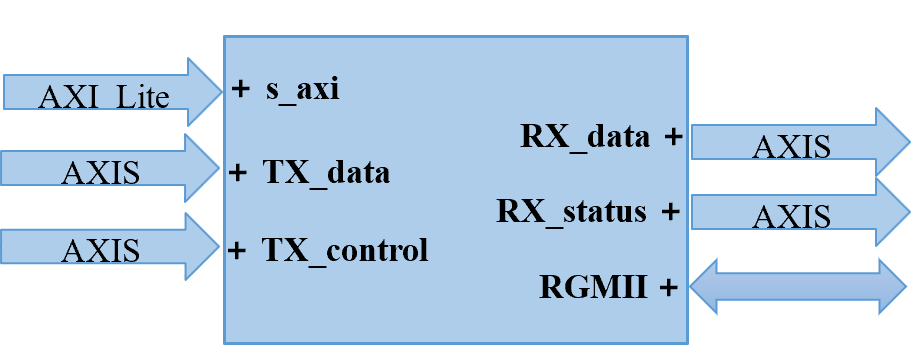
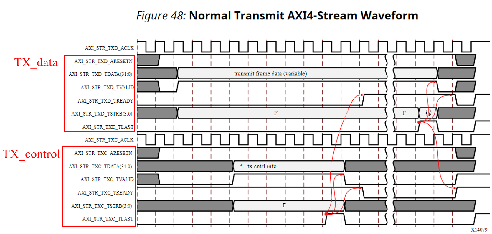
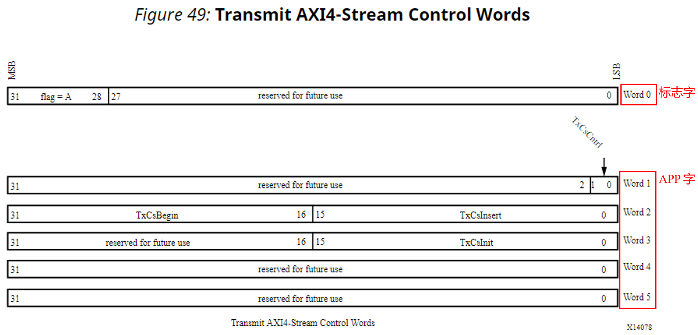
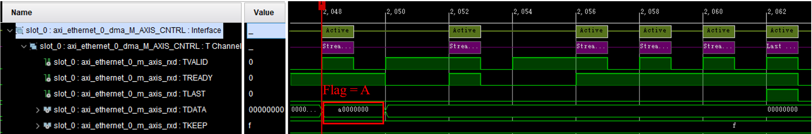
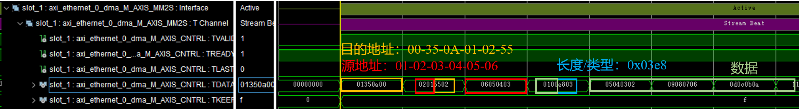
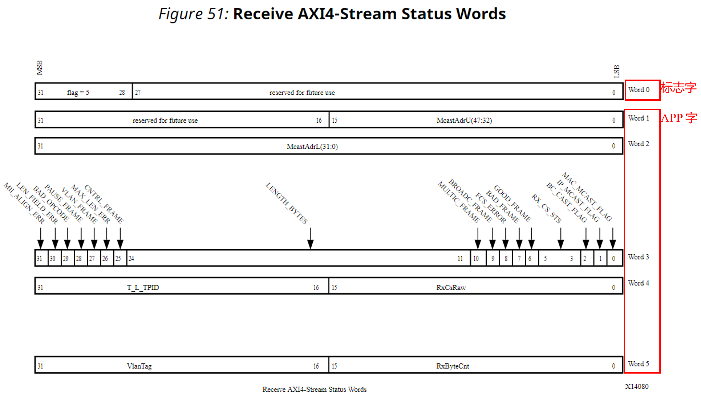
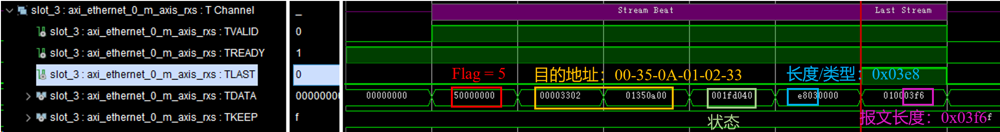
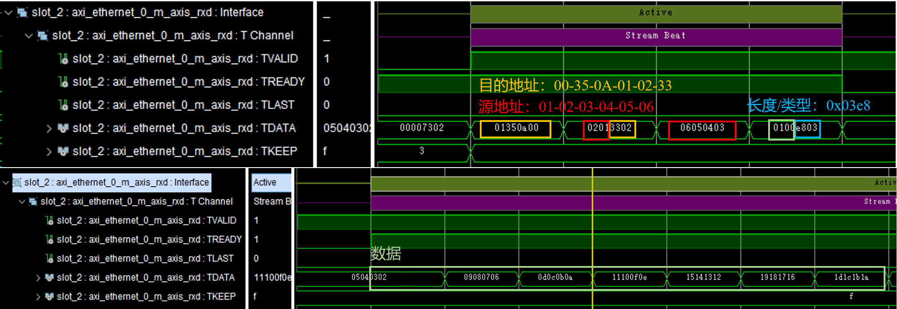

**简体中文** | [English](./Xilinx_AXI_Ethernet_Subsystem_IP_EN.md)

# Xilinx AXI 1G/2.5G Ethernet Subsystem IP 数据流解析

Xilinx AXI 1G/2.5G Ethernet Subsystem 在用户侧采用 32 bit AXI4-Stream 接口传输以太网帧。它与普通的单路 AXI4-Stream 数据通道不同：发送方向把控制信息与帧数据分开，接收方向把状态信息与帧数据分开。因此，不能只关注 `TDATA`，还必须保证同一帧的控制流、状态流和数据流在时序上严格对应。

本文结合实际 ILA 波形，重点说明以下四路接口：

| 方向 | 接口 | 作用 |
| --- | --- | --- |
| 用户逻辑 → IP | TX Control | 发送帧的类型及校验和控制信息 |
| 用户逻辑 → IP | TX Data | 待发送的完整以太网帧 |
| IP → 用户逻辑 | RX Status | 接收帧的地址、长度和错误状态等信息 |
| IP → 用户逻辑 | RX Data | 接收到的完整以太网帧 |

> 本文只讨论 AXI4-Stream 用户侧的数据组织与握手关系，不展开 AXI4-Lite 寄存器配置、PHY 初始化及 RGMII/SGMII/1000BASE-X 接口。

## 1. 双通道 AXI4-Stream 架构

IP 的主要接口关系如下图所示：AXI4-Lite 用于寄存器配置；TX Data 和 TX Control 是两路输入 AXI4-Stream；RX Data 和 RX Status 是两路输出 AXI4-Stream；RGMII 则连接外部以太网 PHY。

  

在 AXI4-Stream 用户侧，数据流与控制/状态流彼此分离，但同一帧的信息必须保持对应。

其中有两条最重要的顺序约束：

1. 发送一帧数据前，必须先把该帧对应的 6 个 TX Control 控制字全部送入 IP；
2. IP 接收到一帧数据后，会先启动 RX Status 状态流，再启动对应的 RX Data 数据流。

也就是说，TX 是“完整接收控制后再接收数据”，RX 是“先启动状态、后启动数据”。RX 两路传输各自受 `TREADY` 反压，完成时刻不一定保持固定先后。控制/状态帧虽然固定只有 6 个 32 bit 字，但数据帧可能从几十字节到数千字节不等，因此设计缓存和反压逻辑时必须保持两路信息的一一对应。

## 2. AXI4-Stream 握手与字节顺序

AXI4-Stream 只有在 `TVALID=1` 且 `TREADY=1` 的时钟上升沿才完成一次传输。如果 `TVALID=1` 而 `TREADY=0`，发送端必须保持 `TDATA`、`TLAST` 和有效字节指示不变，直到握手完成。

本文波形中的数据总线宽度为 32 bit：

- 每次握手最多传输 4 byte；
- `TLAST=1` 表示当前拍是本帧最后一拍；
- 图中的 `TKEEP`，以及官方接口图中的 `TSTRB`/`STRB`，用于指出最后一拍中哪些 byte lane 有效；
- 完整的 4 byte 数据拍对应 `0xF`，最后一拍不足 4 byte 时可能为 `0x1`、`0x3` 或 `0x7`。

ILA 把 `TDATA[31:0]` 显示成一个 32 bit 十六进制数，而以太网帧的第一个字节位于最低 byte lane。分析波形时，应在每个 32 bit 字内部按照 `TDATA[7:0]`、`TDATA[15:8]`、`TDATA[23:16]`、`TDATA[31:24]` 的顺序还原线上字节。多字节的 Length/Type 等网络字段还采用高字节在前的网络字节序，因此直接阅读 ILA 数值时很容易把字节顺序看反。

## 3. 发送方向：TX Control 与 TX Data

### 3.1 先发送控制流，再发送数据流

下面是正常发送一帧报文时的双通道时序。上半部分是 TX Data，下半部分是 TX Control，红框和箭头标出了两路接口之间的先后关系。

  

一帧报文的发送过程可以分成三个阶段：

1. 用户逻辑先在 TX Control 通道发送 6 个 32 bit 控制字，并在第 6 个控制字处拉高 `TLAST`；
2. IP 完整接收控制帧后，才允许 TX Data 通道的 `TREADY` 拉高；
3. 用户逻辑随后发送以太网帧数据，在最后一个有效数据拍拉高 `TLAST`，并用 `TKEEP`/`TSTRB` 指示最后一拍的有效字节。

控制帧接收完成后，在当前数据帧结束以前，IP 不再接收下一帧控制信息。这样可以防止下一帧的控制字与当前数据帧错配。

### 3.2 TX Control 控制字格式

正常 TX Control 帧固定由 Word 0～Word 5 共 6 个 32 bit 字组成。

  

各控制字的作用如下：

| 控制字 | 主要字段 | 说明 |
| --- | --- | --- |
| Word 0 | `Flag[31:28]` | `0xA` 表示正常发送帧；`0x5` 表示接收状态转发帧，常用于 RX 到 TX 的直通或环回路径 |
| Word 1 | `TxCsumCntrl[1:0]` | `00`：不进行校验和卸载；`01`：部分校验和卸载；`10`：完整 IP/TCP/UDP 校验和卸载 |
| Word 2 | `TxCsBegin[31:16]`、`TxCsInsert[15:0]` | 分别给出校验和计算起点和校验和写回位置 |
| Word 3 | `TxCsInit[15:0]` | 部分校验和计算使用的 16 bit 初始值 |
| Word 4 | Reserved | 保留，不要承载用户自定义数据 |
| Word 5 | Reserved | 保留，不要承载用户自定义数据；本字握手时拉高 `TLAST` |

只有启用了 IP 的发送校验和功能时，Word 1～Word 3 中的相关字段才会参与计算。未使用校验和卸载时，最简单且清晰的做法是：Word 0 设为 `0xA0000000`，Word 1～Word 5 置 0。

### 3.3 TX Control 实际波形

下面的 ILA 波形是一帧普通发送报文的控制流。红框中的首字为 `0xA0000000`，即 `Flag=0xA`；其余 5 个 APP 字均为 0，说明本帧没有启用 IP 校验和卸载。最后一个控制字与 `TLAST` 同拍完成握手。

  

图中 `TVALID` 并非连续保持为高，而是受到上游发送节奏影响；这不会破坏协议。真正需要保证的是：每个控制字都只在 `TVALID && TREADY` 时计数，并且一帧必须恰好完成 6 次有效握手。

### 3.4 TX Data 实际波形

控制流被完整接收后，IP 拉高 TX Data 的 `TREADY`，用户逻辑开始发送帧数据。下图已经用不同颜色标出了目的 MAC 地址、源 MAC 地址、Length/Type 字段以及后续数据。

  

该帧可还原为：

| 字段 | 内容 |
| --- | --- |
| 目的 MAC 地址 | `00-35-0A-01-02-55` |
| 源 MAC 地址 | `01-02-03-04-05-06` |
| Length/Type | `0x03E8`，这里表示 1000 byte 数据长度 |
| 数据 | `0x00`～`0xFF` 循环递增 |

波形中各完整数据拍的 `TKEEP=0xF`。若整帧长度不是 4 byte 的整数倍，必须在最后一拍给出正确的 `TKEEP`，否则下游无法判断最后一个 32 bit 字中哪些字节有效。

## 4. 接收方向：RX Status 与 RX Data

### 4.1 先启动状态流，再启动数据流

RX 方向的接口方向与 TX 相反：当 IP 从物理接口接收到一帧报文后，会先在 RX Status 接口启动该帧的状态传输，再在 RX Data 接口启动帧内容传输。两路接口可分别反压，因此“状态流先启动”并不等于在所有情况下“6 个状态字必须全部完成后，数据流才开始”。

因此，下游逻辑需要分别为状态流和数据流提供 `TREADY`，并且不能依赖两路固定的完成时差。使用两个 DMA/FIFO 分别接收状态和数据时，还必须在描述符或本地队列中保持两者的帧序一致。

### 4.2 RX Status 状态字格式

RX Status 同样固定为 6 个 32 bit 字，但其内容与 TX Control 不同。

  

各状态字的主要内容如下：

| 状态字 | 主要字段 | 说明 |
| --- | --- | --- |
| Word 0 | `Flag[31:28]` | 固定为 `0x5`，表示接收状态帧 |
| Word 1 | `MCAST_ADR_U[15:0]` | 多播目的 MAC 地址的高 16 bit；仅在多播标志有效时有意义 |
| Word 2 | `MCAST_ADR_L[31:0]` | 多播目的 MAC 地址的低 32 bit；仅在多播标志有效时有意义 |
| Word 3 | 接收状态位 | 包含帧长度、组播/广播、FCS 错误、坏帧、好帧和接收校验和状态等信息 |
| Word 4 | `T_L_TPID[31:16]`、`RX_CSRAW[15:0]` | 非 VLAN 帧中前者为 Length/Type；后者为原始接收校验和 |
| Word 5 | `VLAN_TAG[31:16]`、`RX_BYTECNT[15:0]` | VLAN 信息以及实际送到 RX Data 接口的帧字节数；本字握手时拉高 `TLAST` |

Word 3 是判断接收帧是否可用的重点。常用字段包括 `GOOD_FRAME`、`BAD_FRAME`、`FCS_ERR`、`LEN_FIELD_ERR` 和 `LENGTH_BYTES`。设计接收逻辑时，不应仅凭 RX Data 有数据就认定报文正确，而应先解析对应 RX Status。

需要特别注意：Word 1 和 Word 2 并不是每一帧都无条件给出普通单播目的 MAC 地址。它们用于多播地址信息，只有相应的多播状态标志有效时才应解析；普通帧的目的地址仍应从 RX Data 中读取。

### 4.3 RX Status 实际波形

下面的状态流对应一帧正确接收的报文。首字为 `0x50000000`，即 `Flag=0x5`；后续状态字给出了接收状态、Length/Type 和接收字节数等信息。

  

图中黄色“目的地址”是按 Word 1 和 Word 2 的观测值拼接出的结果，并且恰好与本帧目的地址一致；但该帧的 `MAC_MCAST_FLAG=0`，按照 PG138 的定义，这两个多播地址字段此时无效，不能把它们当作普通单播目的地址使用。可靠的单播目的地址仍应从后面的 RX Data 帧头中解析。

Word 3 的实际值为 `0x001FD040`：其中 `GOOD_FRAME=1`，`BAD_FRAME=0`，`FCS_ERR=0`，`RX_CS_STS=000`。这表示该帧接收正确，并且本例没有执行接收校验和检查。

这组波形中实际出现了三个容易混淆的长度值：

- Word 4 中的 Length/Type 为 `0x03E8`，因为该值小于 `0x0600`，在本帧中表示 MAC 数据字段长度为 1000 byte；
- Word 3 的 `LENGTH_BYTES` 为 `0x03FA`，即 1018 byte，对应 14 byte 以太网头、1000 byte 数据和 4 byte FCS；
- Word 5 中的 `RX_BYTECNT` 为 `0x03F6`，即 1014 byte，表示实际送到 RX Data 接口的帧长度，其中已经去掉 4 byte FCS。

`0x03F6` 与 `0x03E8` 相差 14 byte，正好对应 6 byte 目的 MAC、6 byte 源 MAC 和 2 byte Length/Type；`0x03FA` 又比 `0x03F6` 多 4 byte，对应线侧帧尾的 FCS。三个数值互相印证：当前 RX Data 中包含以太网头和 1000 byte 数据，但不包含接收 FCS。

### 4.4 RX Data 实际波形

RX Status 启动后，IP 随后在 RX Data 接口给出对应帧。下图上半部分标出了以太网头，下半部分展示了连续的数据内容。

  

该帧可还原为：

| 字段 | 内容 |
| --- | --- |
| 目的 MAC 地址 | `00-35-0A-01-02-33` |
| 源 MAC 地址 | `01-02-03-04-05-06` |
| Length/Type | `0x03E8` |
| 数据 | `0x00`～`0xFF` 循环递增 |

从波形可以看到，帧头和数据在同一条 RX Data 流中连续输出，IP 不会单独剥离 MAC 头。下游若只需要有效载荷，需要自行按 6 byte 目的地址、6 byte 源地址和 2 byte Length/Type 的位置进行解析；VLAN、IPv4/IPv6 等帧型还要继续依据后续字段调整解析偏移。

## 5. 设计与调试中的常见问题

### 5.1 不要让控制流与数据流错帧

TX Control 和 TX Data 必须严格按帧配对。推荐在上游以同一个“帧提交”事件同时锁存控制描述和数据描述，只有控制帧完成 6 次握手后，才允许发送对应数据帧。不能仅根据 `TVALID` 的持续时间计数，必须使用 `TVALID && TREADY`。

RX 方向应按帧序分别记录 RX Status 和 RX Data。两路传输可能因各自的反压而出现时间重叠，不能依靠固定延时进行配对。若两条通道分别进入不同 FIFO，应在系统级考虑其中一路满时的反压传播，避免状态队列与数据队列失去同步。

### 5.2 固定长度的是控制/状态帧，不是数据帧

TX Control 和 RX Status 都固定为 6 个 32 bit 字，`TLAST` 应出现在 Word 5。TX Data 和 RX Data 的长度由具体以太网帧决定，`TLAST` 位置不能写死。

### 5.3 注意最后一拍的有效字节

对 32 bit 数据通道，完整数据拍的有效字节指示为 `0xF`。最后一拍不足 4 byte 时，应根据剩余字节数给出 `0x1`、`0x3` 或 `0x7`。ILA 调试时应同时抓取 `TDATA`、`TVALID`、`TREADY`、`TLAST` 和 `TKEEP`/`TSTRB`，只看 `TDATA` 很难判断帧边界。

### 5.4 不要直接按 32 bit 数值阅读网络字段

以太网字节流、AXI byte lane 和 ILA 十六进制显示的排列方向不同。建议调试脚本先把每个有效 `TDATA` 字按低 byte 到高 byte展开，再按以太网协议字段重新组合。这样可以避免把 MAC 地址、Length/Type 或协议头中的多字节字段读反。

### 5.5 校验和字段取决于 IP 配置

TX Control 的 `TxCsumCntrl`、`TxCsBegin`、`TxCsInsert`、`TxCsInit` 只有在生成 IP 时启用了相应校验和卸载功能才有作用。RX Status 的 `RX_CSRAW` 和 `RX_CS_STS` 也依赖接收校验和配置。若未启用相关功能，应按官方定义把这些字段视为无效或置 0，不要把波形中的保留值当成协议数据。

## 6. 总结

AXI Ethernet Subsystem 用户侧最关键的并不是单条 AXI4-Stream 数据总线，而是同一帧在两条通道上的配对关系：

- TX：先发送 6 个控制字，再发送帧数据；
- RX：状态流先于数据流启动，两路分别遵守 AXI4-Stream 反压；
- 控制/状态帧固定 6 个 32 bit 字，数据帧长度可变；
- RX Status 给出帧是否正确、Length/Type、接收总字节数等元信息；
- 分析 ILA 波形时，必须同时考虑握手、帧边界、有效字节和 byte lane 顺序。

把这几条关系处理正确后，无论后端连接 AXI DMA、AXI FIFO，还是自定义收发逻辑，都可以用同一套方法定位控制流、状态流和数据流之间的问题。

## 7. 参考资料

1. [AMD AXI 1G/2.5G Ethernet Subsystem Product Guide (PG138)](https://docs.amd.com/r/en-US/pg138-axi-ethernet)
2. [AMD PG138：AXI4-Stream Interface](https://docs.amd.com/r/en-US/pg138-axi-ethernet/AXI4-Stream-Interface)
3. [AMD PG138：Transmit AXI4-Stream Interface](https://docs.amd.com/r/en-US/pg138-axi-ethernet/Transmit-AXI4-Stream-Interface)
4. [AMD PG138：Normal Transmit AXI4-Stream Control Words](https://docs.amd.com/r/en-US/pg138-axi-ethernet/Normal-Transmit-AXI4-Stream-Control-Words)
5. [AMD PG138：Receive AXI4-Stream Interface](https://docs.amd.com/r/en-US/pg138-axi-ethernet/Receive-AXI4-Stream-Interface)
