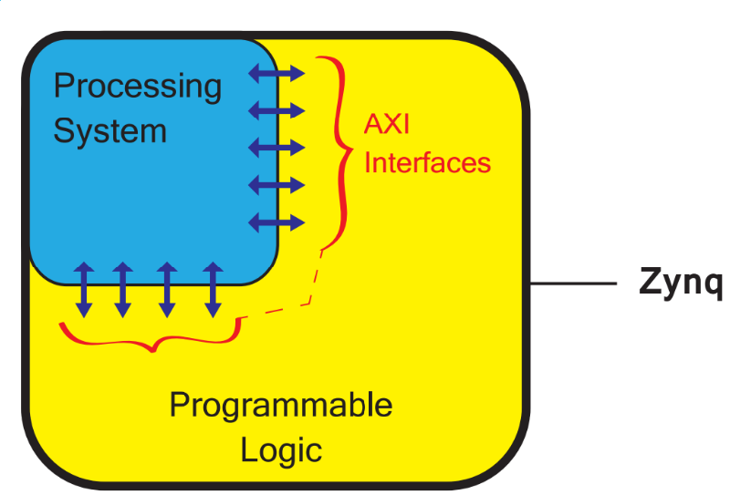
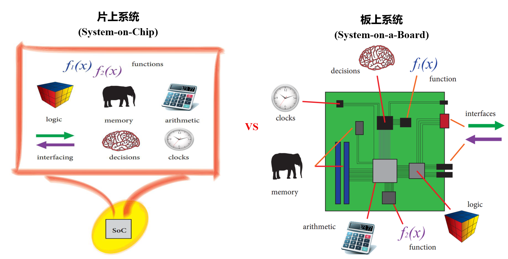
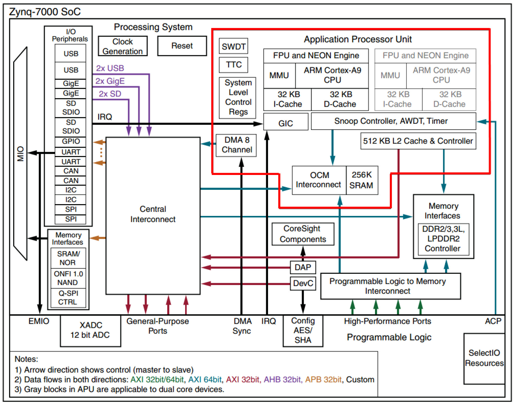
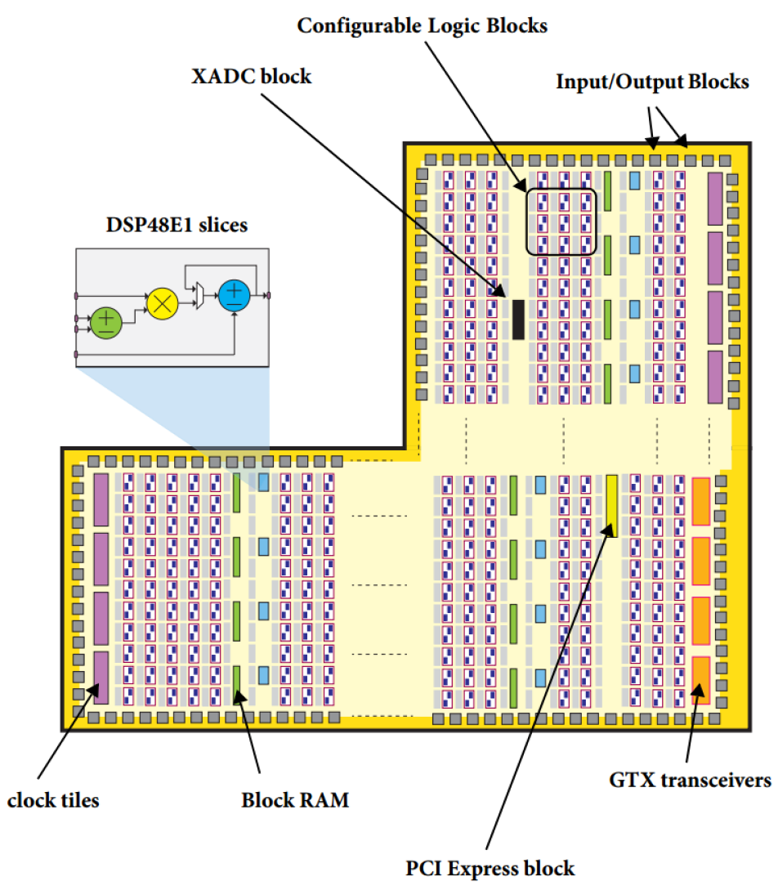
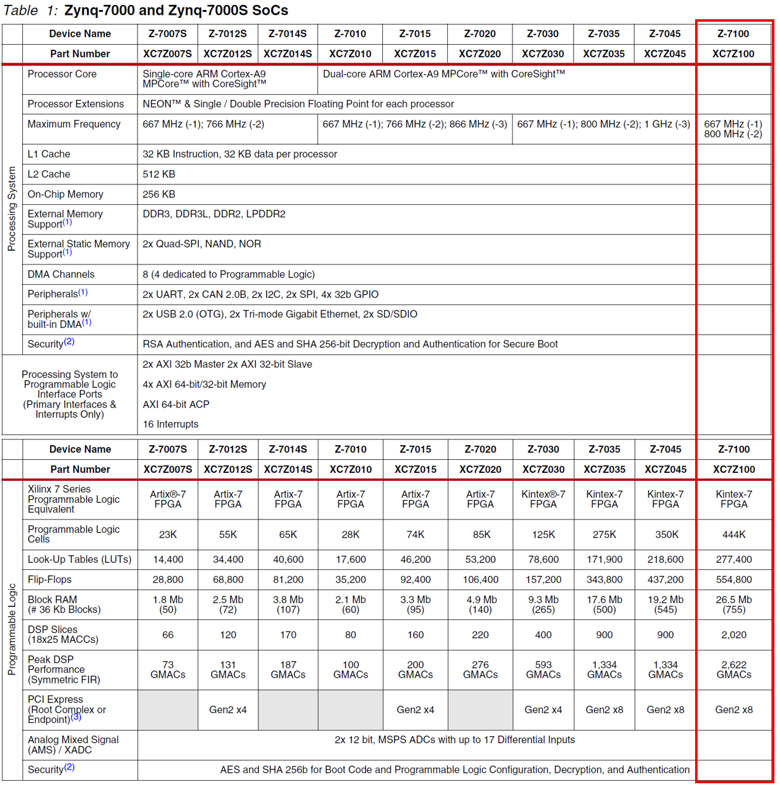
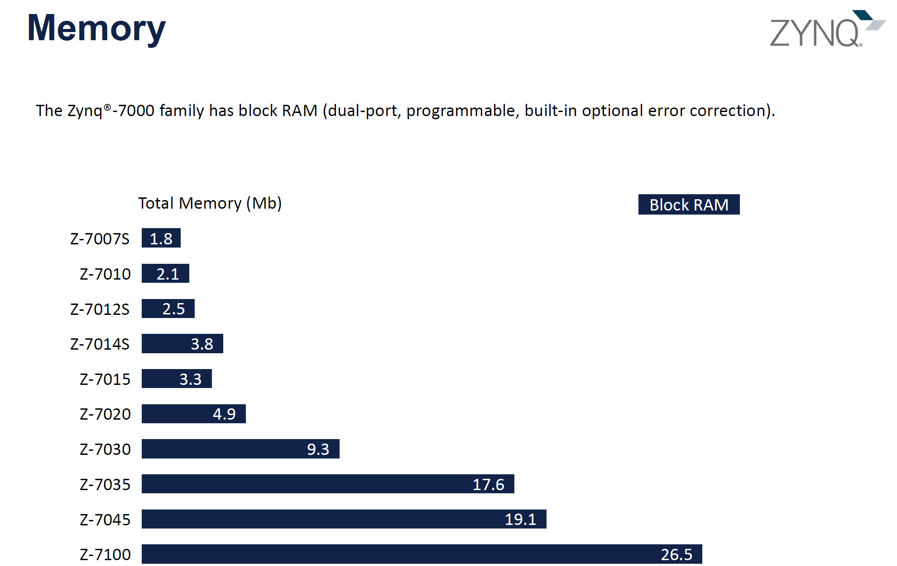
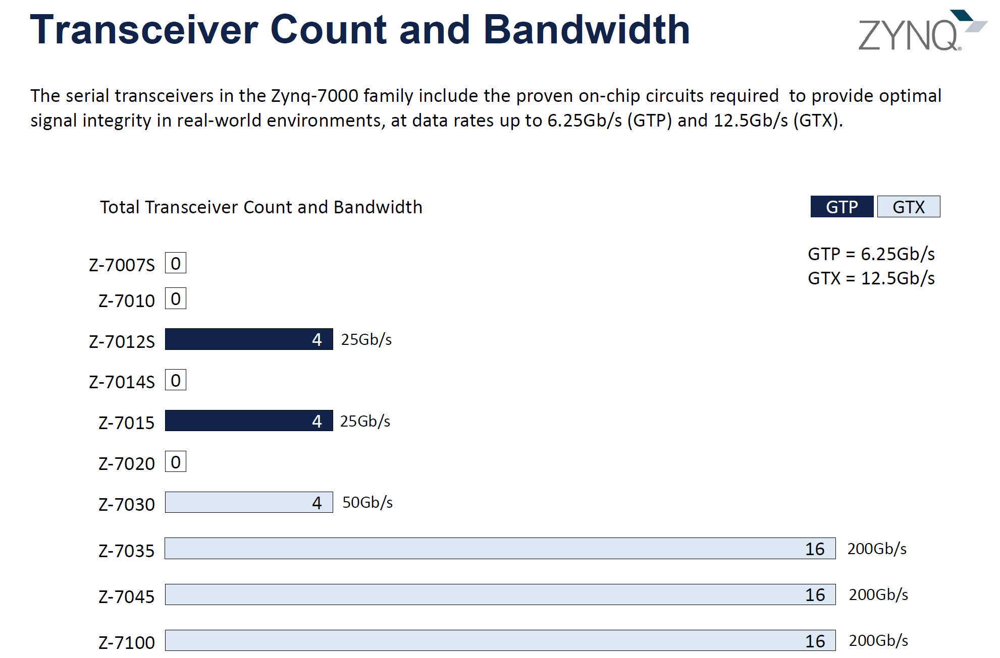
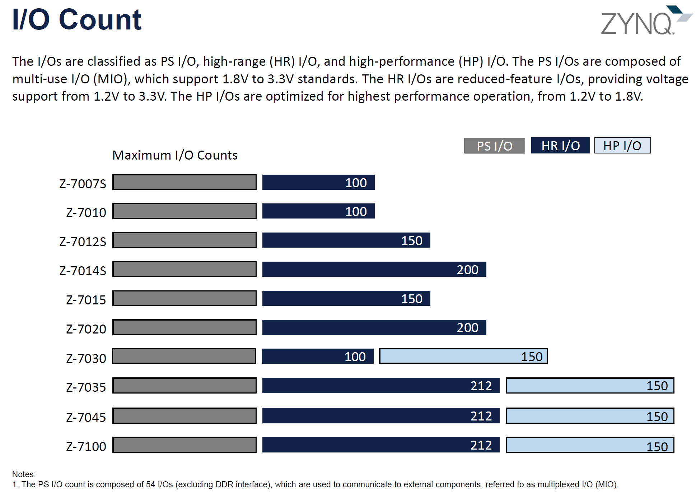
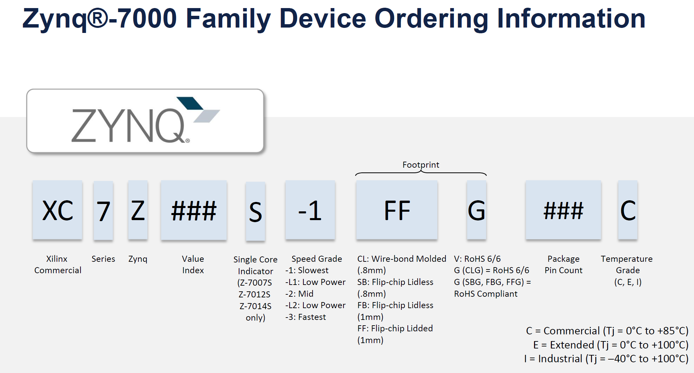

[简体中文](./Zynq7000_Resource_Overview.md) | **English**

# Zynq-7000 Device Architecture and Resource Overview

Zynq-7000 is an All Programmable SoC family originally introduced by Xilinx and now offered by AMD. It integrates an Arm Cortex-A9 processing system and Xilinx 7 series programmable logic on a single device. This combination can run Linux, bare-metal applications, and conventional embedded software while using FPGA logic for high-speed interfaces, real-time control, and data-stream acceleration.

This article introduces the Zynq-7000 processing system (PS), programmable logic (PL), PS–PL interconnects, and device-selection methods from an engineering perspective. The resource figures are intended to illustrate differences across the family. For an actual device selection, always consult the current AMD data sheet and packaging guide for the specific device, package, and speed grade.

## 1. Overall Zynq-7000 Architecture

### 1.1 PS, PL, and AXI

Zynq-7000 consists primarily of two parts:

- **PS (Processing System):** includes the Arm Cortex-A9 processor, caches, on-chip memory, DDR controller, DMA, interrupt controller, and common peripherals;
- **PL (Programmable Logic):** uses the 7 series FPGA architecture and includes LUTs, flip-flops, Block RAM, DSP48E1 slices, clocking resources, I/O, and—on selected devices—high-speed transceivers and a PCIe integrated block.

The primary data paths between the PS and PL use AXI interfaces. The two domains are also connected through interrupts, clocks, resets, DMA request/acknowledge signals, EMIO, device configuration, and XADC interfaces. The PS–PL relationship therefore cannot be reduced to “a single AXI bus.”

<em>Figure 1: Relationship among the PS, PL, and AXI interfaces in Zynq-7000</em>

Zynq-7000S devices use a single-core Cortex-A9, while the other Zynq-7000 devices use a dual-core Cortex-A9. The PL is not limited to acting as an ordinary PS peripheral: it can implement register-based control logic, serve as a high-throughput data plane, access PS DDR directly, or participate in cache-coherent accesses through the ACP.

### 1.2 SoC and Board-Level Systems

A conventional board-level system often uses separate devices for processing, memory, interfaces, and dedicated logic. An SoC integrates several of these functions into a single device. This integration can shorten data paths and reduce board-level interconnects, but overall performance, power consumption, and cost still depend on the system architecture, software, and peripheral design.

<em>Figure 2: Structural comparison between a system-on-chip (left) and a board-level system (right)</em>

The key value of Zynq-7000 is that it places the “software control plane” and the “hardware data plane” in the same device. The PS handles configuration, protocols, scheduling, and complex software, while the PL handles deterministic timing, parallel computation, and high-speed data movement.

## 2. Processing System Resources

The following diagram shows the main components of the Zynq-7000 PS. The second Cortex-A9 core shown in gray applies only to dual-core devices.

<em>Figure 3: Zynq-7000 Processing System architecture</em>

### 2.1 APU, Caches, and On-Chip Memory

| Resource | Function and key points |
| --- | --- |
| Cortex-A9 | Single-core on Zynq-7000S and dual-core on the other devices; supports Armv7-A and can run Linux or bare-metal software |
| MMU | Provides virtual memory, address translation, and memory-attribute management; an important foundation for running a full Linux system |
| NEON/FPU | Supports SIMD and single-/double-precision floating-point operations, accelerating selected signal-processing and multimedia algorithms |
| L1 Cache | Each CPU core has a 32 KB instruction cache and a 32 KB data cache |
| L2 Cache | A 512 KB L2 cache is shared by all processor cores |
| OCM | 256 KB of low-latency on-chip SRAM for boot code, real-time data, or critical buffers |
| SCU | Maintains coherency between processor cores and connects coherent access paths such as the ACP |

Both the OCM and PL Block RAM are on-chip memories, but they serve different purposes. The OCM resides in the PS address space and directly serves the processing system. Block RAM resides in the PL and is well suited to parallel buffers, FIFOs, lookup tables, and custom memory structures.

### 2.2 External Memory, DMA, and Peripherals

The PS DDR controller supports DDR3, DDR3L, DDR2, and LPDDR2, with a configurable 16-bit or 32-bit data width. Memory type, speed, and ECC restrictions should be verified against the device data sheet and the board-level design.

The PS provides Quad-SPI and NAND interfaces for boot and nonvolatile storage, while the SMC supports NOR/SRAM interfaces; SRAM itself is not nonvolatile memory. The PS also contains an eight-channel DMA controller. Some channels provide request/acknowledge interfaces to the PL, allowing data transfers among peripherals, memory, and the PL with less CPU involvement.

Common PS peripherals include:

- two USB 2.0 OTG controllers;
- two Gigabit Ethernet controllers;
- two SD/SDIO controllers;
- two UARTs, two CAN controllers, two I²C controllers, and two SPI controllers;
- GPIO, triple timer counters, watchdogs, and other peripherals.

PS peripheral signals can be routed through MIO or EMIO:

- **MIO:** PS peripherals are multiplexed directly onto dedicated PS pins. Most devices provide up to 54 MIO pins, while some small packages provide only 32;
- **EMIO:** signals from peripherals that support EMIO routing are passed into the PL, where they can be processed by logic or brought out through PL I/O.

Not every PS peripheral supports EMIO. USB, Quad-SPI, and SMC, for example, cannot simply be rerouted through EMIO. Consult the IOP Interface Routing table in UG585 for the supported routing options.

### 2.3 Interrupts, Timers, Debug, and Security

- **GIC:** manages interrupts from the CPUs, PS peripherals, and PL; the PL can provide 16 shared peripheral interrupt inputs to the PS;
- **TTC:** the PS contains two Triple Timer Counter modules, each with three independent timers/counters;
- **Watchdog:** includes CPU private watchdogs and a System Watchdog Timer (SWDT); the `S` in SWDT means System, not Software;
- **CoreSight/DAP:** provides Arm debug, trace, and system-diagnostic capabilities;
- **Secure-boot resources:** include AES-CBC-256 decryption, HMAC-SHA-256 authentication, and RSA-2048 public-key authentication support.

These security blocks are designed primarily to protect boot images and PL configuration data. They should not be treated as general-purpose cryptographic accelerators that are freely available to ordinary applications.

### 2.4 Choosing a PS–PL Interface

| Interface | Direction (relative to the PS) | Width | Typical use |
| --- | --- | ---: | --- |
| `M_AXI_GP0/1` | PS master accessing the PL | 32 bit | AXI-Lite registers and low-bandwidth control/status access |
| `S_AXI_GP0/1` | PL master accessing the PS | 32 bit | PL access to the PS address space or low-bandwidth memory-mapped paths |
| `S_AXI_HP0~3` | PL master accessing the PS | 32/64 bit | PL access to DDR through the PS memory interconnect; suitable for video, acquisition, and high-volume data streams |
| `S_AXI_ACP` | PL master making coherent accesses to the PS | 64 bit | Accelerator access to cacheable memory through the SCU, reducing explicit cache maintenance |
| Interrupts/clocks/resets | Bidirectional or fixed direction | — | Event notification, clock delivery, reset control, and system coordination |

Interface selection should not be based on theoretical width alone. Sustained bandwidth also depends on AXI burst length, outstanding transactions, data-width conversion, DDR efficiency, cache policy, and the software-driver architecture.

## 3. Programmable Logic Resources

The PL uses the Xilinx 7 series FPGA architecture. The following diagram illustrates a typical resource distribution. The PCIe integrated block and GTP/GTX high-speed transceivers shown in the diagram are available only on selected devices and packages, not on every Zynq-7000 device.

<em>Figure 4: Typical resource distribution in the Zynq-7000 PL</em>

### 3.1 CLB: General-Purpose Logic Resources

A CLB (Configurable Logic Block) contains LUTs, flip-flops, carry chains, and related interconnect resources. It can implement combinational logic, state machines, counters, pipelines, and control logic. Some LUTs can also be configured as distributed RAM or shift registers.

In engineering practice, “Logic Cells” alone is not a sufficient metric. The resources that actually affect implementation and timing are typically LUTs, flip-flops, carry chains, distributed RAM, and the placement and routing congestion associated with them.

### 3.2 DSP48E1: Multiply-Accumulate and High-Throughput Computing

Each DSP48E1 slice includes a 25 × 18-bit multiplier, 48-bit arithmetic logic, and an accumulation path. It is suitable for datapaths such as multiply-accumulate operations, filters, FFTs, digital downconversion, correlation, and matrix computation.

Compared with constructing multipliers from LUTs, DSP48E1 slices generally provide higher performance and better power efficiency. High utilization, however, does not automatically translate into high effective throughput. The design must still account for pipeline depth, bit-width growth, rounding and saturation, and the physical distribution of DSP columns.

### 3.3 Block RAM: On-Chip Block Memory

Block RAM uses 36 Kb as its basic resource unit and can be split into two 18 Kb blocks. It supports dual-port access and multiple width/depth configurations. Typical applications include:

- AXI-Stream FIFOs and inter-module buffers;
- FIR coefficients, lookup tables, and waveform tables;
- line buffers, portions of frame buffers, and data reordering;
- MicroBlaze instruction and data memory;
- ping-pong buffers and multiport memory structures.

When selecting a device, check not only the total BRAM capacity but also the required port modes, target clock frequency, and physical distribution. Having enough aggregate capacity does not guarantee an easy place-and-route closure.

### 3.4 Clock Management and Distribution

The primary 7 series clocking resources include:

- **CMT (Clock Management Tile):** each CMT contains one MMCM and one PLL for frequency multiplication/division, phase adjustment, and jitter filtering;
- **Clock buffers and networks:** BUFG, BUFH, BUFR, BUFIO, and related resources distribute global, regional, or I/O clocks;
- **PS–PL clocks:** the PS can output multiple configurable clocks to the PL, while the PL can also use external clock pins or transceiver reference clocks.

Clocking resources are constrained not only by quantity but also by regions and routing. Device selection should identify the number of asynchronous clock domains, GT reference clocks, I/O clocks, and cross-region clocking requirements.

### 3.5 SelectIO and High-Speed Resources

| Resource | Description |
| --- | --- |
| HR I/O | Supports a broad voltage range and is suitable for general-purpose single-ended and differential interfaces; supported standards depend on the bank voltage and device documentation |
| HP I/O | Intended for higher-performance, lower-voltage interfaces; available only on selected devices and packages |
| GTP/GTX | GTP supports line rates up to approximately 6.25 Gb/s, while GTX supports up to 12.5 Gb/s; channel count, line rate, and reference-clock pins depend on the device and package |
| PCIe Block | Selected devices include a Gen2 PCIe integrated block used with the device's GTP or GTX transceivers |
| XADC | The family integrates a dual 12-bit, 1 MSPS XADC; the number of usable external analog inputs depends on the package |

The native user interface of the PCIe integrated block is defined by the corresponding PCIe IP. AXI memory mapping, DMA, and register access generally require a bridge IP, DMA IP, or custom logic. The PCIe block should not be assumed to provide all upper-layer functions by itself.

## 4. Selecting a Zynq-7000 Device

### 4.1 Start with the Family Resource Table

The Zynq-7000S family comprises the Z-7007S, Z-7012S, and Z-7014S, each with a single-core Cortex-A9. Devices from Z-7010 through Z-7100 use a dual-core Cortex-A9. The devices differ substantially in LUTs, flip-flops, BRAM, DSP slices, PCIe, high-speed transceivers, and I/O count.

<em>Figure 5: PS and PL resource comparison across the Zynq-7000/7000S family, with Z-7100 highlighted</em>

The resource table is useful for the first screening pass, but it cannot determine the final device by itself. Different packages for the same device may expose different numbers of I/O pins, GT channels, reference clocks, MIO pins, and analog inputs. Speed grade and temperature grade must also be checked.

### 4.2 BRAM Capacity

<em>Figure 6: Block RAM capacity comparison across Zynq-7000 devices</em>

If a design contains radar, radio, imaging, or large-scale DSP algorithms; requires substantial RAM as a compute buffer; or uses MicroBlaze, wide-data FIFOs, and multistage ping-pong buffers, a separate BRAM budget should be prepared.

Note that Figure 6 labels the Z-7045 as having 19.1 Mb, while the family table in DS190 specifies 19.2 Mb (545 36 Kb Block RAMs). Final device selection should follow the current revision of DS190 and the applicable device data sheet.

### 4.3 High-Speed Transceivers

<em>Figure 7: High-speed transceiver count and theoretical aggregate line rate; actual resources depend on the package</em>

Selecting a device for a high-speed interface requires more than multiplying the number of channels by the rated line speed. Encoding overhead, FEC, protocol IP, reference clocks, transceiver placement, and the actual package pins must also be considered. For example, 100GbE has used both CAUI-10 at 10 × 10.3125 Gb/s and CAUI-4 at 4 × 25.78125 Gb/s. A 12.5 Gb/s GTX in Zynq-7000 cannot directly meet the per-lane line rate required by CAUI-4.

The aggregate bandwidth in the figure is simply the product of channel count and maximum line rate. It is neither the net throughput available to an application nor a guarantee that every package exposes the illustrated number of GT channels.

### 4.4 I/O Count and Package

<em>Figure 8: Overview of PS, HR, and HP I/O counts; exact quantities must be verified for the device-and-package combination</em>

Before starting a design, identify at least the following:

- the required number of single-ended, differential, and dedicated clock pins;
- each I/O bank's voltage, I/O standards, and drive requirements;
- PS MIO, DDR, GT, GT reference-clock, and XADC pins;
- package pin availability and PCB-routing capability;
- power rails, power sequencing, and thermal conditions.

Figure 8 is a family-level overview and does not represent the actual maximum for every package. For example, the number of HR I/O pins available on some Z-7100 packages differs from the value shown. Always verify the configuration with UG865 or the Vivado device/package view.

### 4.5 Reading the Ordering Code

<em>Figure 9: Structure of a Zynq-7000 device ordering code</em>

Using `XC7Z100-2FFG900I` as an example:

| Field | Meaning |
| --- | --- |
| `XC` | Xilinx Commercial product prefix |
| `7Z100` | Xilinx 7 series Zynq device, index 100 |
| `-2` | Speed grade |
| `FF` | Lidded flip-chip package with 1.0 mm ball pitch |
| `G` | Lead-free designator in the `FFG` package code; officially defined as RoHS 6/6 with Exemption 15 |
| `900` | Package ball count |
| `I` | Industrial temperature grade, with a junction-temperature range of −40°C to +100°C |

Similar device names do not imply direct interchangeability. Any device migration requires a new review of package pins, power, banks, MIO/DDR, GT resources, boot mode, speed grade, and temperature grade.

## 5. Engineering Selection Method

### 5.1 Establish a Resource Baseline

It is difficult to estimate every FPGA resource accurately at the beginning of a project. A more reliable approach is to:

1. select a completed design or module that most closely resembles the target project;
2. rerun synthesis and implementation using the target Vivado version and target device;
3. record LUT, flip-flop, BRAM, DSP, BUFG/MMCM, I/O, GT, power, and timing margin;
4. build separate resource models for new functions, then add them to the baseline design;
5. perform a complete implementation early instead of relying only on post-synthesis resource estimates.

Resource estimation should be performed separately for each resource type. Even when substantial LUT capacity remains, BRAM, DSP, clocking, I/O, GT resources, or local routing congestion may already be the limiting factor.

### 5.2 Resource Headroom Is Not a Fixed Percentage

The source document recommends reserving approximately 25% of the resources. This can serve as an initial engineering guideline for an ordinary project, but it is not an official rule and does not guarantee timing closure.

> Designs with rapidly evolving algorithms, high clock rates, complex cross-SLR or cross-region routing, or uncertain future features should reserve more headroom. For stable production designs that have already been verified through physical implementation, the margin can be reassessed using the implementation results.

In addition to resource utilization, consider:

- Worst Negative Slack, Total Negative Slack, and clock-domain-crossing constraints;
- high-fanout nets, long routes, and local congestion;
- whether the physical locations of BRAM, DSP, and GT resources match the data paths;
- whether enough clock regions, banks, and package pins are available;
- measured power, junction temperature, and power-supply margin.

### 5.3 Conditions for Cost-Down Migration in Production

If the final implementation has substantial spare resources, a smaller pin-compatible device in the same package may be evaluated to reduce cost. The following conditions must be satisfied:

- the package and migration rules explicitly support the change;
- I/O banks, voltages, MIO, DDR, and boot pins are compatible;
- GT channels, reference clocks, PCIe/XADC, and other hard resources still meet the requirements;
- power rails, speed grade, and temperature grade meet the product requirements;
- synthesis, implementation, timing verification, and board-level testing are repeated for the new device.

A safer strategy is therefore usually to select a device with sufficient margin during development and evaluate a smaller device after the design is frozen, instead of trading away implementation margin for device cost at the beginning of the project.

## 6. Summary

The advantage of Zynq-7000 is not merely that it places an Arm processor and FPGA fabric in the same package. It provides a tightly coupled processing system, programmable logic, and high-speed interconnect architecture: the PS is well suited to software, protocols, and system management, while the PL is well suited to deterministic timing, parallel computation, and high-speed data streams.

When selecting a device, first decide whether each software function, algorithm, and interface belongs in the PS or PL. Then prepare separate budgets for LUTs/flip-flops, BRAM, DSP, clocking, I/O, GT resources, DDR, and power. Finally, include the exact package, speed grade, temperature grade, and board-level constraints in the evaluation. Do not select a device solely by its name or Logic Cell count.

## 7. References

- [DS190: Zynq-7000 SoC Data Sheet: Overview](https://docs.amd.com/v/u/en-US/ds190-Zynq-7000-Overview)
- [UG585: Zynq-7000 SoC Technical Reference Manual](https://docs.amd.com/r/en-US/ug585-zynq-7000-SoC-TRM)
- [UG865: Zynq-7000 Packaging and Pinout](https://docs.amd.com/v/u/en-US/ug865-Zynq-7000-Pkg-Pinout)
- [UG474: 7 Series FPGAs Configurable Logic Block](https://docs.amd.com/r/en-US/ug474_7Series_CLB)
- [UG473: 7 Series FPGAs Memory Resources](https://docs.amd.com/v/u/en-US/ug473_7Series_Memory_Resources)
- [UG479: 7 Series DSP48E1 Slice](https://docs.amd.com/v/u/en-US/ug479_7Series_DSP48E1)
- [UG472: 7 Series FPGAs Clocking Resources](https://docs.amd.com/v/u/en-US/ug472_7Series_Clocking)
- [UG480: 7 Series FPGAs and Zynq-7000 SoC XADC](https://docs.amd.com/r/en-US/ug480_7Series_XADC)
