# Zynq-7000 安全启动与防护策略：AES、RSA 与 eFUSE 部署

在基于 Zynq-7000 的产品中，攻击者拿到整机后，通常可以直接接触 PCB、启动 Flash、调试接口和软件镜像。如果系统没有建立可信启动链，仅依靠“代码不公开”很难长期保护 FPGA 逻辑和软件资产。

Zynq-7000 提供 AES-256-CBC 加密、HMAC-SHA-256 完整性校验、RSA-2048 公钥认证，以及 eFUSE、BBRAM 等片上密钥存储机制。合理组合这些能力，可以提高抄板、镜像逆向、恶意篡改和未授权固件运行的门槛。

本文先梳理各类安全机制的职责，再说明密钥、启动镜像和 eFUSE 的部署流程。文末的 GUI 操作以 Vivado/SDK 2018.3 为背景，新版工具的菜单位置可能不同，但安全架构和密钥管理原则不变。

> **重要提醒：** eFUSE 是一次性资源。错误烧录 AES 密钥、安全启动位或 JTAG 禁用位，可能造成器件永久无法启动、无法调试，并影响返修。量产前必须在专用测试器件上验证完整流程，控制位应在功能验证完成后最后烧录。

## 1. 先明确要防什么

常见风险可以分为以下几类：

| 风险 | 攻击方式 | 主要防护目标 | Zynq-7000 对应能力 |
| --- | --- | --- | --- |
| 产品克隆 | 抄板并复制外部 Flash | 让复制的镜像无法在未授权器件上运行 | 片上 AES 密钥、eFUSE 或 BBRAM |
| 软件破解 | 读取 Flash，分析 FSBL、Bitstream 和应用程序 | 保护镜像机密性 | AES-256-CBC 加密 |
| 软件篡改 | 替换启动分区或注入恶意镜像 | 验证镜像来源和完整性 | RSA-2048 认证 |
| 调试接口滥用 | 通过 JTAG、DAP 或测试模式读取和控制器件 | 限制生产设备调试入口 | JTAG/DFT 相关 eFUSE 控制位 |

这里必须区分三个概念：

- **AES 加密**解决的是机密性问题，让攻击者无法直接读取镜像原文；
- **HMAC**用于加密镜像的对称完整性校验，Zynq-7000 的 AES 和 HMAC 引擎在安全解密流程中配合使用；
- **RSA 认证**解决镜像来源和公钥信任问题，适合建立从 BootROM 到后续分区的公钥信任链。

如果产品的防护目标仅限于**防止产品克隆和软件破解**，可以使用 AES-256-CBC 加密启动镜像，并在每台授权设备的 PL eFUSE 中烧录与镜像匹配的 AES 密钥。攻击者即使完整复制外部 Flash，也无法在没有对应密钥的器件上解密并启动该镜像；直接读取 Flash 得到的也只是密文。对于这一限定场景，AES 加密镜像配合授权设备烧录 eFUSE，即可满足主要防护需求，不一定需要额外启用 RSA 认证。

但 AES 主要解决镜像保密和器件授权问题，不能代替厂家签名所提供的来源认证。因此，不能简单地认为“使用 AES 就等于完成了所有安全启动能力”。如果产品要求只有厂家签发的镜像才能运行，或要支持基于公钥信任链的安全升级，则应进一步评估 RSA 认证。AMD 官方资料列出的 Zynq-7000 安全启动能力包括 AES-CBC 256 bit、HMAC-SHA-256 和 RSA 2048 bit，具体选择取决于产品威胁模型。[UG821：Secure Boot Support](https://docs.amd.com/r/en-US/ug821-zynq-7000-swdev/Secure-Boot-Support)

## 2. Zynq-7000 的安全资源

### 2.1 AES 密钥：PL eFUSE 与 BBRAM

Zynq-7000 的 AES 密钥存放在 PL 侧，可选择 eFUSE 或 BBRAM 作为密钥源。

| 密钥存储 | 特点 | 适用场景 |
| --- | --- | --- |
| BBRAM | 易失，需要电池维持；密钥可清除和重新写入 | 开发验证、需要密钥可撤销的设备 |
| PL eFUSE | 非易失、一次性烧录，不依赖电池 | 流程成熟后的量产设备 |

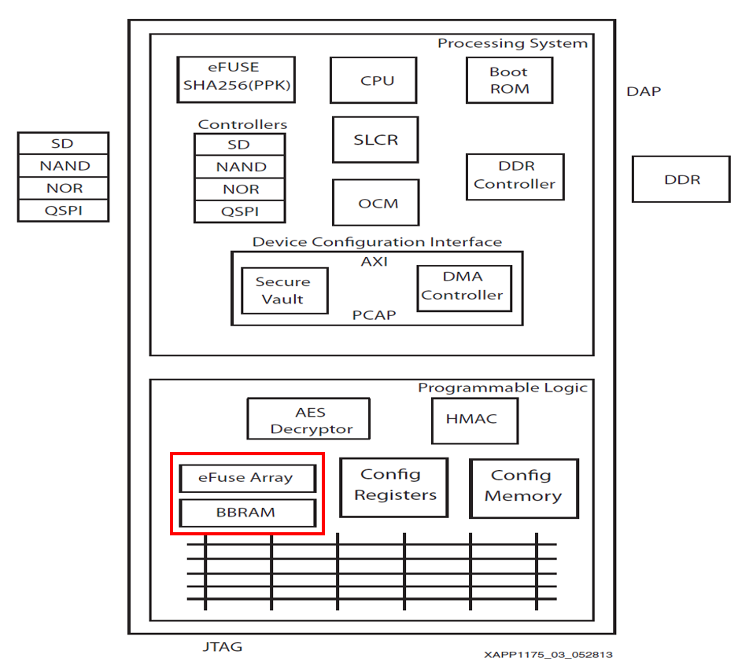

两种密钥源必须与 Boot Image Header 中的加密状态匹配。使用 eFUSE 密钥的加密镜像和使用 BBRAM 密钥的加密镜像具有不同的 Header 标识；配置不匹配可能触发安全锁定。[UG585：Boot Image Header](https://docs.amd.com/r/en-US/ug585-zynq-7000-SoC-TRM/Boot-Image-Header)

对于抗克隆设计，还要决定使用“全产品共享密钥”还是“每台设备独立密钥”：

- 共享密钥便于生产和统一发布镜像，但一旦密钥泄露，影响范围可能覆盖整批设备；
- 每台设备独立密钥可以缩小单点泄露影响，但需要逐设备生成镜像或设计安全的个性化生产流程。

### 2.2 RSA 根信任：PS eFUSE

RSA 认证使用两级密钥体系：

- PPK：Primary Public Key，主公钥；
- PSK：Primary Secret Key，主私钥；
- SPK：Secondary Public Key，次公钥；
- SSK：Secondary Secret Key，次私钥。

器件的 PS eFUSE 保存 PPK 的 SHA-256 哈希值，而不是私钥。启动镜像中携带 PPK、SPK、SPK 签名和分区签名。验证关系如下：

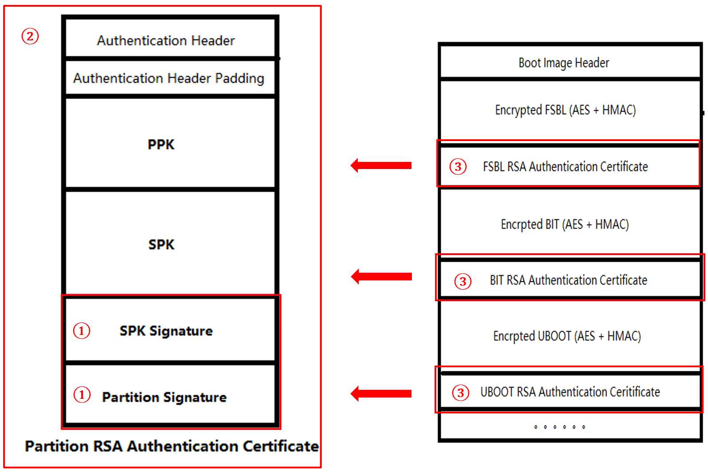

图中 ①②③ 表示 RSA 认证信息的生成和放置关系：

1. **生成两类签名（①）**：使用主私钥 PSK 对次公钥 SPK 进行签名，得到 `SPK Signature`；使用次私钥 SSK 对对应分区进行签名，得到 `Partition Signature`。
2. **组成分区认证证书（②）**：`Authentication Header`、填充区域、PPK、SPK、`SPK Signature` 和 `Partition Signature` 共同组成该分区的 RSA Authentication Certificate。
3. **证书跟随对应分区（③）**：FSBL、Bitstream 和 U-Boot 等需要认证的分区，都有各自对应的 RSA 认证证书。Bootgen 将证书放入启动镜像，使启动代码能够逐分区完成认证。

器件启动时的验证顺序与证书的生成过程相反：

1. BootROM 对证书中的 PPK 计算 SHA-256，并与 PS eFUSE 中保存的 PPK Hash 比较，先确认主公钥可信；
2. 使用已经确认可信的 PPK 验证 `SPK Signature`，确认次公钥 SPK 未被替换；
3. 使用 SPK 验证 `Partition Signature`，确认对应的 FSBL、Bitstream、U-Boot 或其他分区来源可信且内容未被修改。

任意一级验证失败，当前分区都不会被作为可信代码继续执行。因此，修改 PPK、SPK、分区内容或其签名，都会破坏认证链。

主私钥 PSK 和次私钥 SSK 只能保存在受控签名环境中，不能写入启动镜像、源码仓库或生产设备。PPK/SPK 的完整结构和认证证书格式可参考 [UG821：Authentication Overview](https://docs.amd.com/r/en-US/ug821-zynq-7000-swdev/Authentication-Overview) 与 [UG821：Authentication Certificate](https://docs.amd.com/r/en-US/ug821-zynq-7000-swdev/Authentication-Certificate)。

### 2.3 硬件安全模块

安全启动涉及的主要硬件资源包括：

- **BootROM**：片上只读启动代码，负责最早期的启动与安全状态判断；
- **OCM**：片上存储器，BootROM 将 FSBL 加载到这里执行；
- **AES Decryptor**：PL 内的 AES-256 解密引擎；
- **HMAC Engine**：使用 SHA-256 的消息认证引擎；
- **PL eFUSE/BBRAM**：存放 AES 密钥；
- **PS eFUSE**：存放 PPK Hash 及 RSA、DFT 等安全控制位；
- **NVM Controller**：访问 QSPI、NAND、NOR、SD 等启动介质。

Zynq-7000 的主安全启动会使用 PL 内的 AES/HMAC 硬核，因此解密期间 PL 必须处于供电状态。[UG585：Master Secure Boot](https://docs.amd.com/r/en-US/ug585-zynq-7000-SoC-TRM/Master-Secure-Boot)

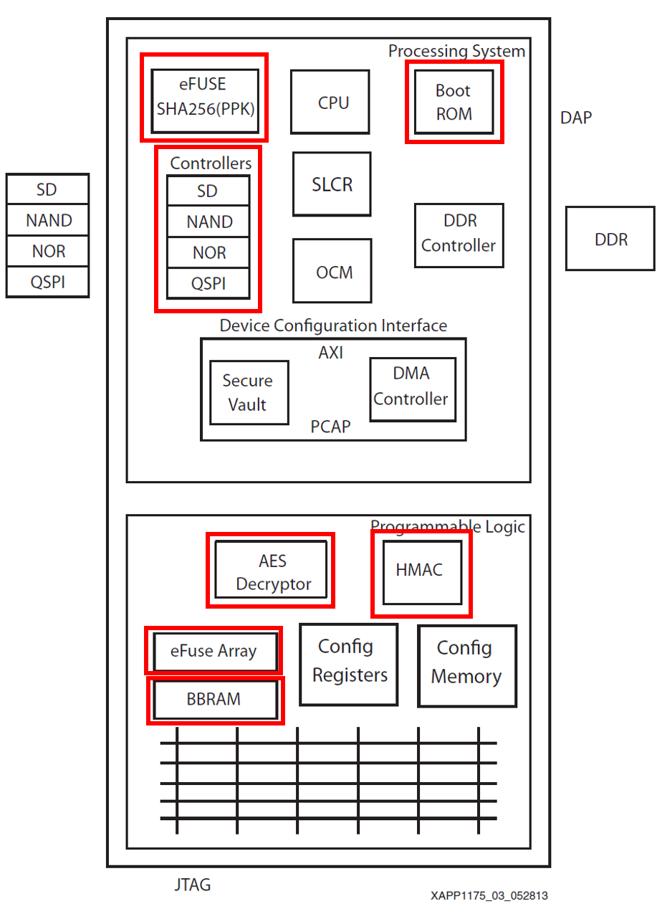

## 3. 加密、认证和镜像结构

### 3.1 AES/HMAC 的处理顺序

在 Bootgen 侧，软件分区先生成 HMAC，再进行 AES 加密；在器件侧则以相反方向处理：先进行 RSA 认证（若启用），再进行 AES 解密，最后验证 HMAC。AES 会同时包裹分区数据、HMAC 签名和 HMAC 密钥。[XAPP1175：Secure Boot of Zynq-7000 SoC](https://docs.amd.com/v/u/en-US/xapp1175_zynq_secure_boot)

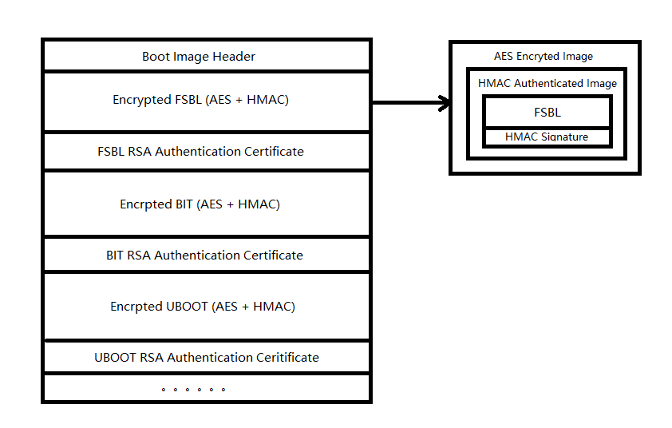

图中 ①②③ 表示一个软件分区从原始数据到 AES 加密镜像的逐层封装过程：

1. **生成 HMAC 签名（①）**：Bootgen 使用 HMAC 密钥对 FSBL、Bitstream、U-Boot 或其他待保护分区进行计算，生成对应的 `HMAC Signature`。
2. **形成 HMAC Authenticated Image（②）**：原始分区数据与 `HMAC Signature` 组合，形成带完整性校验信息的 HMAC 认证镜像。
3. **形成 AES Encrypted Image（③）**：使用 AES 密钥对整个 HMAC 认证镜像进行加密，最终得到写入外部 Flash 的 AES 加密镜像。外部只能读取到密文，无法直接获得分区原始内容。

镜像生成和芯片启动的处理方向正好相反：

- **生成镜像时**：分区数据 → 生成 HMAC 签名 → 组成 HMAC 认证镜像 → AES 加密 → 写入 Flash；
- **芯片启动时**：从 Flash 读取密文 → 使用 PL eFUSE 或 BBRAM 中的 AES 密钥解密 → 验证 HMAC → 验证通过后装载并执行分区。

因此，AES 负责隐藏分区内容，HMAC 负责确认解密后的数据是否完整，两者在 Zynq-7000 的加密启动流程中配合工作。

### 3.2 哪些分区需要保护

典型 Zynq 系统可能包含：

1. FSBL；
2. PL Bitstream；
3. U-Boot 或裸机程序；
4. Linux Kernel、Device Tree、RootFS；
5. 应用程序与配置数据。

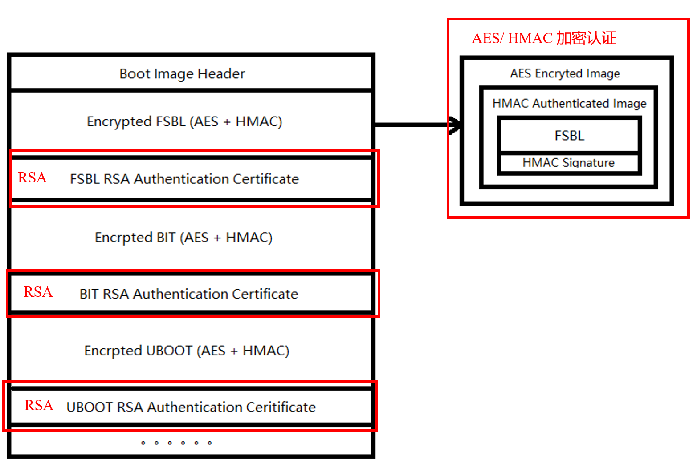

这张图展示了 BOOT.bin 中两类安全机制的组合关系：

- FSBL、Bitstream 和 U-Boot 的主体位于 `Encrypted ... (AES + HMAC)` 区域。AES 负责隐藏分区原文，HMAC 用于验证解密后数据的完整性；
- 每个需要 RSA 认证的分区都配有独立的 `RSA Authentication Certificate`，用于验证该分区是否来自受信任的签名者，以及内容是否被修改；
- AES/HMAC 与 RSA 是两层不同的保护：前者侧重镜像保密和对称完整性校验，后者侧重公钥来源认证。项目可以按威胁模型只使用 AES/HMAC，也可以将二者结合。

图中的排列也说明，安全属性是按分区配置的。FSBL、Bitstream、U-Boot 可以分别决定是否加密、是否进行 RSA 认证，并非只能对整个 BOOT.bin 使用一种统一策略。

要保护链路后端的某个组件，前面的加载器也必须可信。只给应用程序签名，却让未认证的 U-Boot 负责加载它，攻击者仍可能替换 U-Boot 绕过检查。

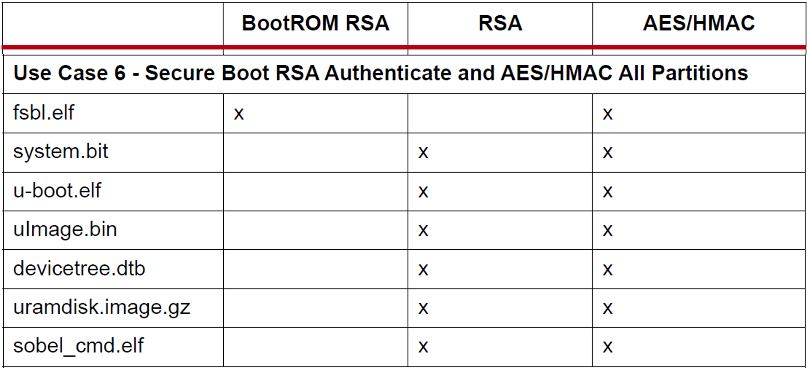

上表对应全部分区同时启用认证和加密的最高防护场景（Use Case 6）：

- **FSBL**：由片上 BootROM 使用 RSA 进行首次认证，同时使用 AES/HMAC 解密和校验；
- **Bitstream、U-Boot、Linux Kernel、Device Tree、Ramdisk 和应用程序**：由前一级可信启动代码继续执行 RSA 认证，并使用 AES/HMAC 进行解密和完整性校验；
- 表中的 `x` 表示该分区启用了对应能力。只有 FSBL 位于 `BootROM RSA` 列，因为 BootROM 直接负责建立安全启动的第一个软件信任点；后续分区则沿可信启动链继续验证。

这是一种最严格的配置示例，并不是所有产品都必须照搬。如果目标只是防止产品克隆和离线软件破解，可以只为需要保护的分区启用 AES/HMAC，并在授权设备的 PL eFUSE 中烧录匹配的 AES 密钥；只有需要验证厂家签发来源时，才需要进一步启用 RSA 认证。


每个箭头都代表一次信任传递。安全策略不一定要求所有分区都加密，但负责加载和验证后级组件的代码必须位于可信链中。

## 4. 安全启动流程

Zynq-7000 的安全启动可以按职责划分为三个阶段。

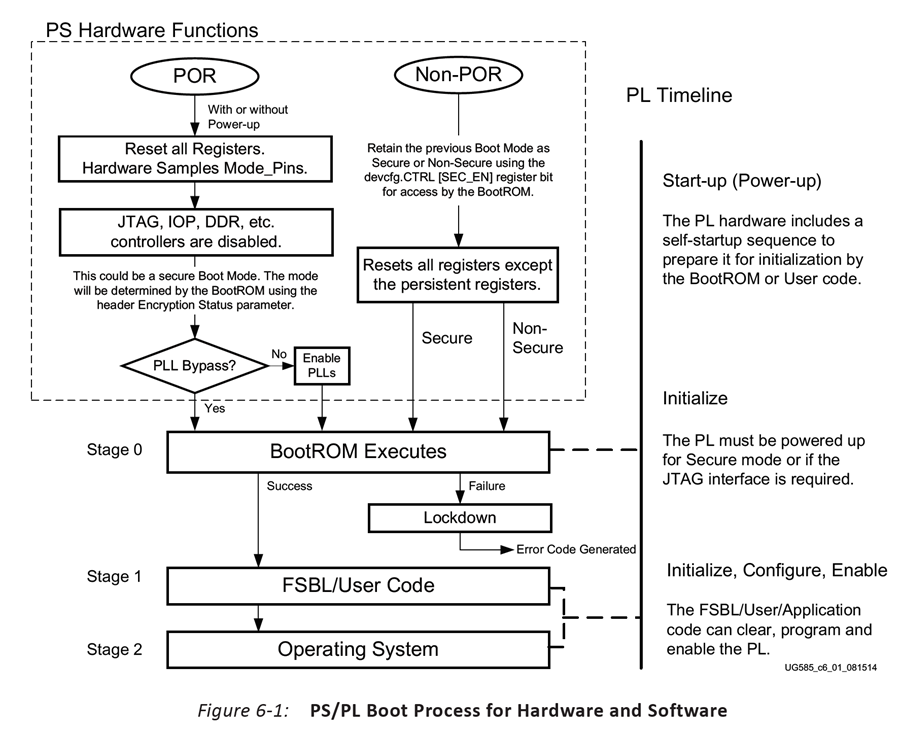

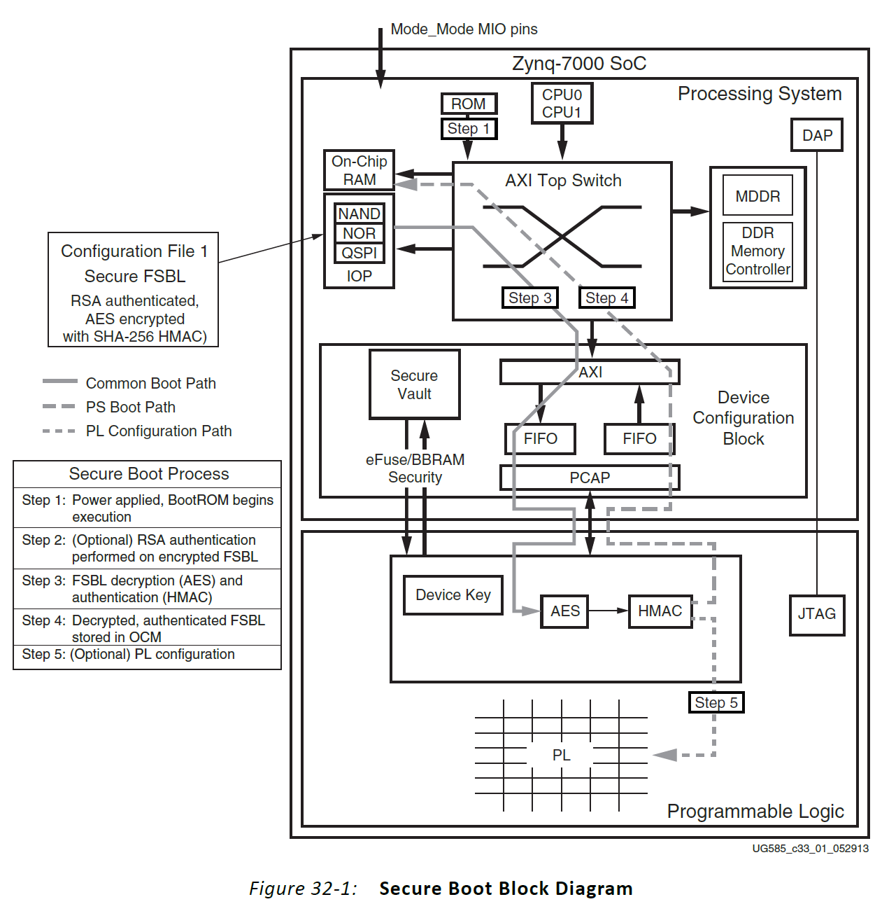

### 4.1 Stage 0：BootROM

1. 系统上电后执行片上 BootROM；
2. BootROM 从 QSPI、SD 等启动设备读取 Boot Header；
3. 将 FSBL 装载到 OCM；
4. 若启用 RSA，先依据 PS eFUSE 中的 PPK Hash 验证 FSBL 认证证书；
5. 若 FSBL 被加密，调用 PL 侧 AES/HMAC 引擎完成解密和完整性校验；
6. 验证成功后跳转到 FSBL。

### 4.2 Stage 1：FSBL

FSBL 根据分区属性处理 Bitstream、U-Boot 或裸机程序：

- 对需要 RSA 认证的分区验证认证证书；
- 对需要 AES 加密的分区完成解密和 HMAC 校验；
- 将 Bitstream 配置到 PL；
- 将软件分区装载到 OCM 或 DDR；
- 将控制权交给下一阶段。

Bootgen 根据 BIF 描述生成 Boot Header、分区表和分区数据。每个分区可以单独配置加密与认证属性。[UG821：Boot Image Creation](https://docs.amd.com/r/en-US/ug821-zynq-7000-swdev/Boot-Image-Creation)

### 4.3 Stage 2：U-Boot、操作系统和应用

从 U-Boot 开始，后续镜像的验证通常由软件负责。Linux 应用、升级包和配置文件是否继续验证，取决于系统自己的启动脚本、密钥管理和更新协议。

安全启动只能保证“从受信任根开始执行经过验证的代码”，不能自动消除运行时漏洞。产品仍需完善异常恢复、运行监控和日志审计。

## 5. Vivado/SDK 2018.3 实战流程

### 5.1 实战方案与环境

本章实操主线只启用 AES/HMAC 加密，不在镜像生成界面启用 RSA。它对应前文所述的防产品克隆和离线软件破解场景；如果还需要厂家签名来源认证，可以在相同流程上增加 RSA 配置。原稿中个别 FSBL 编译宏和启动日志来自 AES+RSA 的组合验证，正文会将这些内容明确标为可选项，不把它们混入 AES-only 的必做步骤。

验证环境如下：

- Vivado/SDK 2018.3；
- XC7Z020CLG400-2；
- Windows 10；
- 启动介质为 QSPI；
- 加密对象为 FSBL、Bitstream 和裸机应用。

后续按照“准备 FSBL → 生成加密镜像 → 烧录 PL eFUSE → 写入 QSPI → 断电启动验证”的顺序展开。每个操作步骤都紧跟对应截图和完成判据。以下界面来自旧版 SDK，正式量产时应以当前器件、工具版本和 AMD 官方文档为准。

### 5.2 第一步：准备 FSBL

#### 5.2.1 导出并导入硬件平台

**步骤 1：在 Vivado 中导出硬件描述文件。**


`system_wrapper.hdf` 是 Vivado 2018.3 导出的硬件描述文件，其中包含 PS 配置、外设和地址映射等信息。SDK 需要以该文件为基础建立硬件平台，后续生成的 FSBL 才能与当前硬件设计匹配。

**步骤 2：在 SDK 中导入硬件平台。**

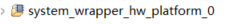

将 HDF 导入 SDK 后，会生成对应的 Hardware Platform。创建 FSBL 时应选择这个平台，避免使用其他工程或旧版本硬件配置。

#### 5.2.2 创建 FSBL 与 BSP

**步骤 3：新建 Application Project。**

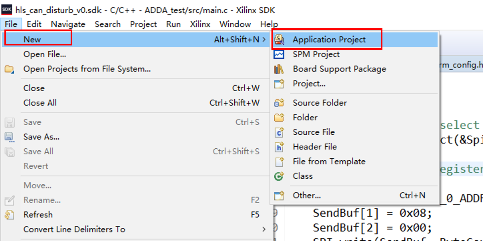

如红框所示，在 SDK 菜单中依次选择 **File → New → Application Project**，开始创建 FSBL 应用工程。

**步骤 4：设置 FSBL 工程和 BSP。**


工程名称填写 `FSBL`，操作系统平台选择 `standalone`，处理器选择 `ps7_cortexa9_0`。同时选择 **Create New**，为 FSBL 新建配套的 `FSBL_bsp` 板级支持包，然后点击 **Finish**。

**步骤 5：选择 Zynq FSBL 模板。**

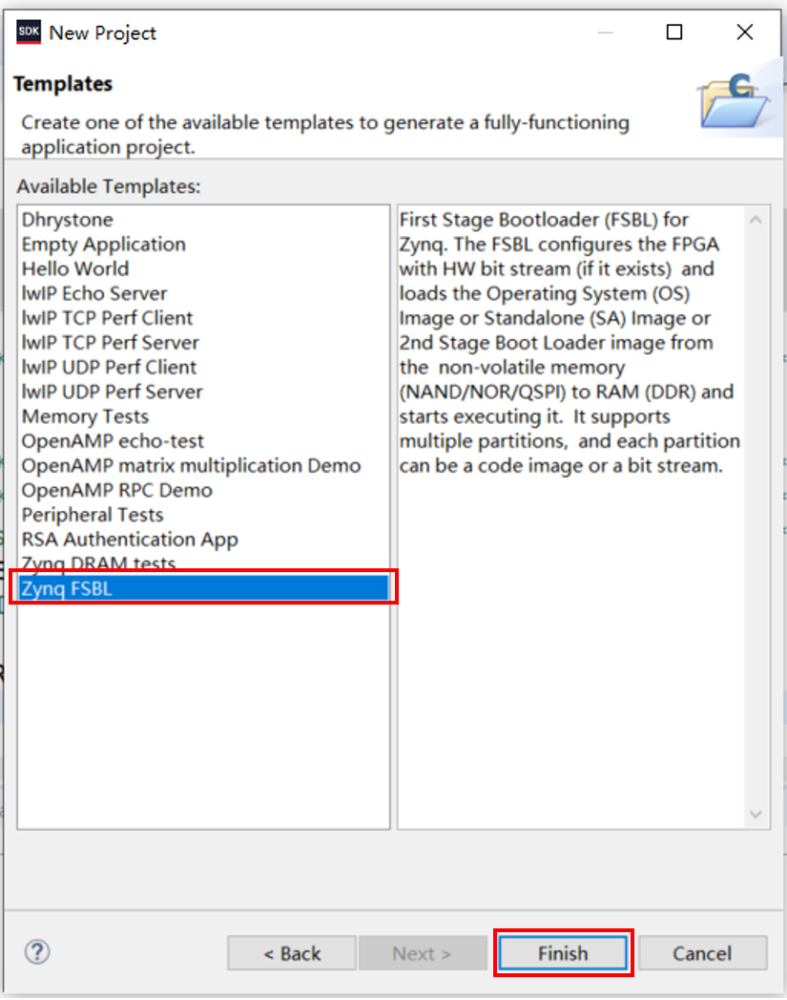

在模板列表中选择 **Zynq FSBL**。SDK 会据此生成适用于 Zynq-7000 的第一阶段启动加载程序，而不是创建普通的空白裸机工程。

**完成检查：确认 FSBL 与 BSP 已生成。**

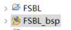

创建完成后，Project Explorer 中应同时出现 FSBL 应用工程和对应的 BSP：前者包含启动流程源码，后者提供器件驱动、库和硬件参数。

#### 5.2.3 配置 FSBL 编译宏

**步骤 6：打开 FSBL 工程属性。**


右击 FSBL 工程并选择 **Properties**，进入编译选项页面。下一步在编译器的 Symbols 页面配置调试宏；只有启用 RSA 时才需要加入 RSA 支持宏。

原工程使用过以下调试与 RSA 相关宏：

```text
DEBUG
FSBL_DEBUG_GENERAL
FSBL_DEBUG_INFO
RSA_SUPPORT
```


红框中的 `DEBUG`、`FSBL_DEBUG_GENERAL` 和 `FSBL_DEBUG_INFO` 用于输出不同级别的启动日志；`RSA_SUPPORT` 用于编译 FSBL 的 RSA 认证支持。如果项目只采用 AES/HMAC 加密而不启用 RSA，可以不添加 `RSA_SUPPORT`。

宏名称和启用方式与具体 SDK 版本有关，升级工具后应重新核对 FSBL 文档。

### 5.3 第二步：生成 AES 加密镜像

本节完全使用 SDK 的 **Create Boot Image** 图形界面，依次设置输出位置、AES 加密、eFUSE 密钥源和启动分区，最终生成加密的 `BOOT.bin` 与对应的 `.nky` 文件。

**步骤 1：打开 Create Boot Image。**

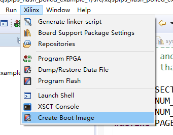

在 SDK 菜单中选择 **Xilinx → Create Boot Image**，打开 Bootgen 的图形化配置界面。该界面最终仍会生成 BIF，并调用 Bootgen 组装启动镜像。

**步骤 2：设置输出路径。**

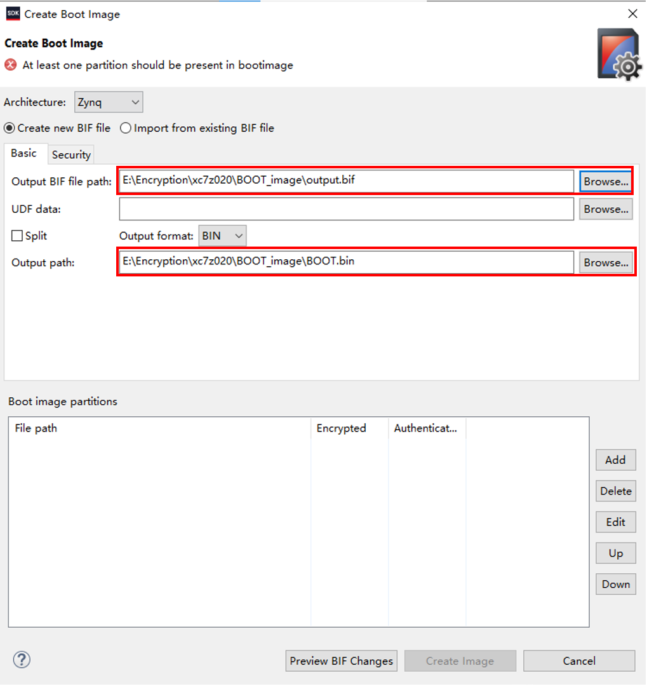

在 **Basic** 页面确认 Architecture 为 `Zynq`，分别设置 BIF 文件和最终 `BOOT.bin` 的输出路径。此时分区列表为空，后续需要按启动顺序逐个加入 FSBL、Bitstream 和应用程序。

**步骤 3：启用 Encryption。**


切换到 **Security → Encryption**，勾选 **Use Encryption**。启用后，界面才会开放 AES 密钥文件、器件型号和 Key store 等安全选项。

**步骤 4A：已有 NKY 时导入密钥文件。**

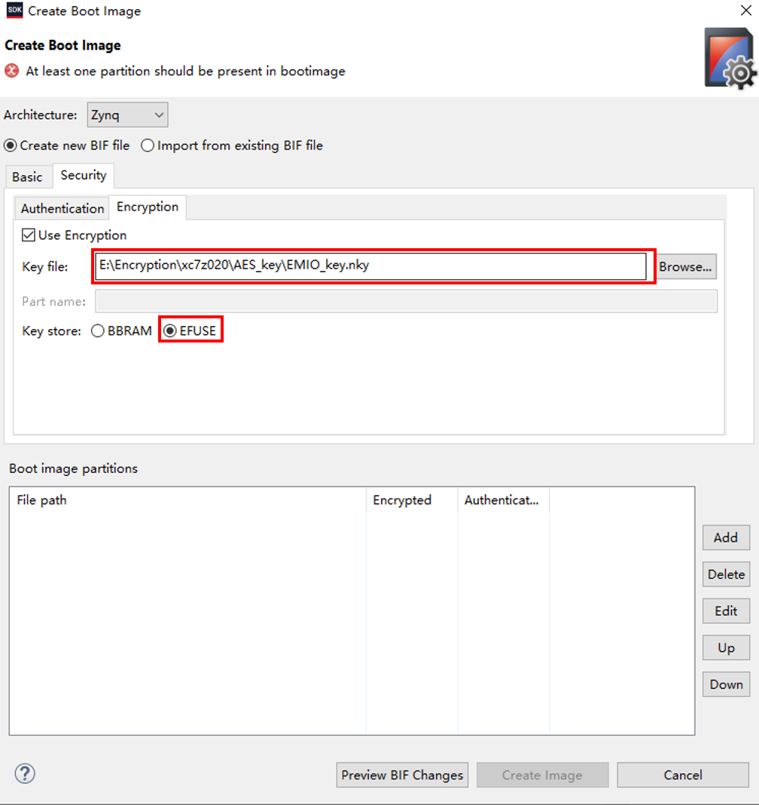

如果已有 `.nky` 文件，在 **Key file** 中选择该文件，并将 **Key store** 设为 `EFUSE`。生成镜像所用 AES 密钥必须与目标器件 PL eFUSE 中烧录的密钥一致。

**步骤 4B：没有 NKY 时由 Bootgen 生成。**


如果还没有 `.nky` 文件，可以将 **Key file** 留空，填写准确的器件型号并选择 `EFUSE`。创建镜像时 Bootgen 会生成新的密钥文件，器件型号必须与实际 Zynq 芯片匹配。

**步骤 5：加入并配置启动分区。**

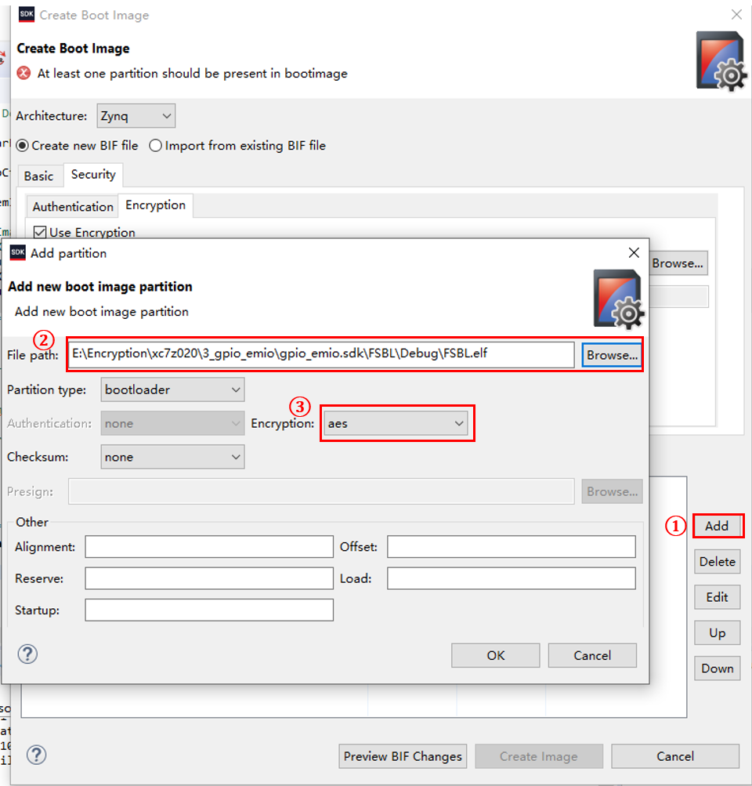

点击右侧 **Add** 添加启动分区。FSBL 的 Partition type 应设为 `bootloader`，并在 Encryption 中选择 `aes`；随后用同样方式加入 Bitstream 和应用程序。

**步骤 6：检查分区顺序并创建镜像。**

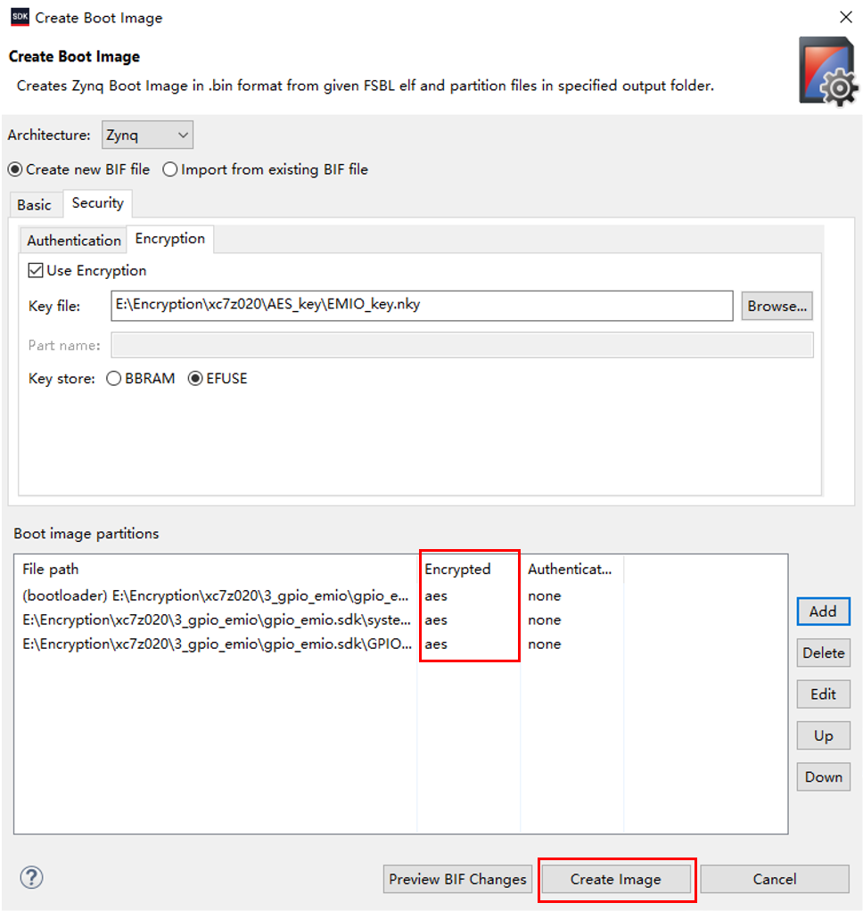

分区列表中的 `Encrypted` 列应显示三个分区均为 `aes`，并保证 FSBL 位于第一项。核对文件路径、分区顺序和安全属性后，再点击 **Create Image**。

**步骤 7：检查输出文件。**

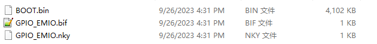

生成完成后，输出目录中会包含启动镜像、BIF 配置和 `.nky` 密钥文件：`BOOT.bin` 用于写入启动介质，BIF 记录镜像组成，NKY 保存本次加密所需的参数。

**检查 NKY：确认密钥参数与本次 BOOT.bin 对应。**

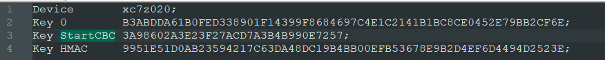

NKY 中的 `Key 0` 是 AES-256 密钥，`StartCBC` 是 CBC 模式使用的初始值，`HMAC` 字段用于生成分区的 HMAC 签名。这组参数共同对应当前生成的 `BOOT.bin`。

### 5.4 第三步：烧录 PL eFUSE

PL eFUSE 有两种常见烧录方式：开发阶段可以通过 Vivado Hardware Manager 直接操作；生产阶段可基于 XilSKey 示例制作独立烧录镜像。两条路径的目标相同，但使用场景不同。

#### 5.4.1 方法 A：Hardware Manager 直接烧录（开发调试）

**步骤 1：通过 JTAG 连接并选中目标器件。**

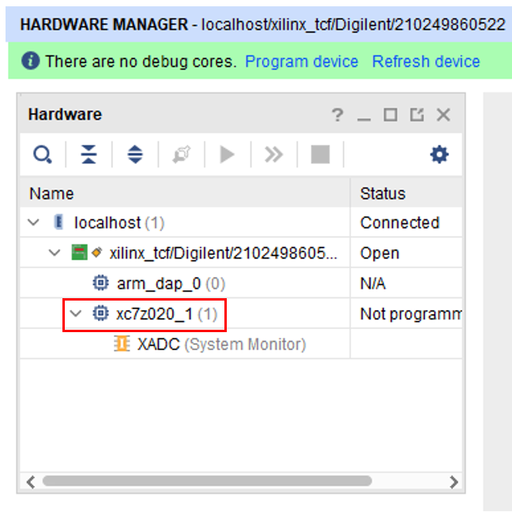

在 Hardware Manager 中通过 JTAG 连接目标板，设备树中应能识别 `arm_dap_0` 和目标 Zynq 器件。图中红框标出了本次操作的 `xc7z020_1`。

**步骤 2：打开 eFUSE 编程向导。**

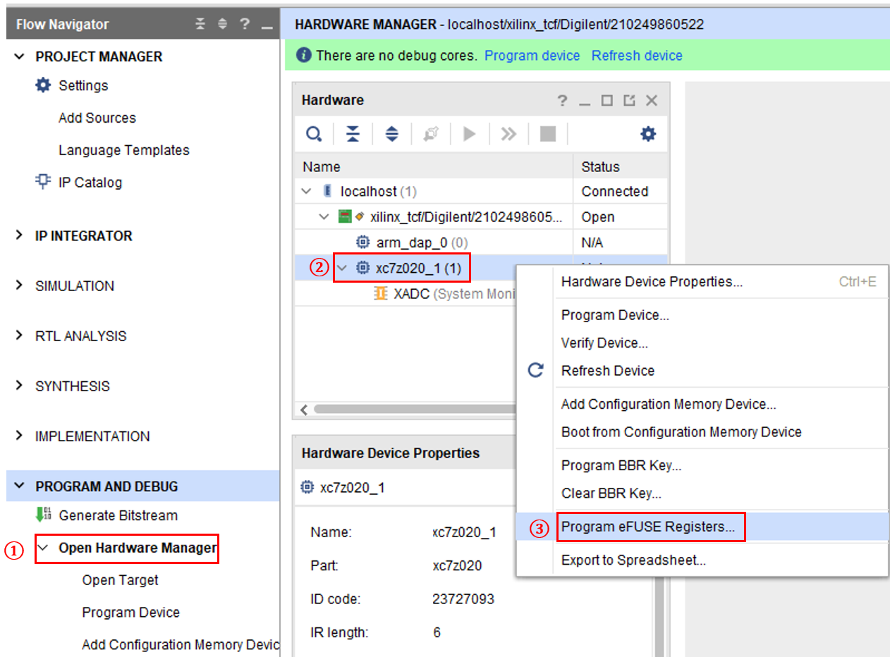

依次打开 **Hardware Manager**，右击目标 Zynq 器件并选择 **Program eFUSE Registers**。该入口用于直接配置器件的一次性 eFUSE 资源。

**步骤 3：载入与 BOOT.bin 匹配的 NKY。**

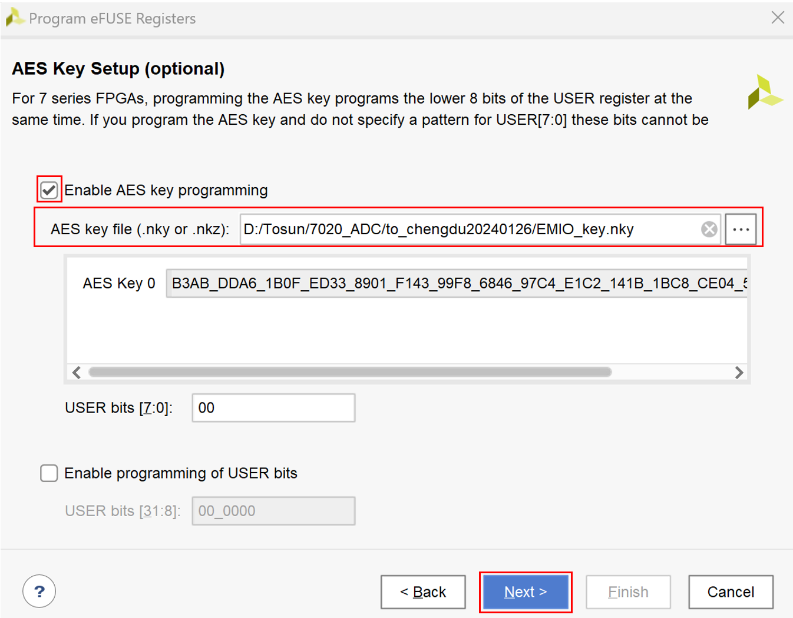

勾选 **Enable AES key programming**，选择生成 `BOOT.bin` 时使用的 `.nky` 文件。工具会解析并显示其中的 AES Key。该页面同时提示编程 AES Key 会涉及部分 USER 位，因此进入下一步前还要核对 `USER[7:0]` 等字段是否符合产品定义。

**步骤 4：选择要永久写入的控制位。**


勾选 **Enable control register programming** 后，可按产品需求选择控制位。图中选择的 `R_EN_B_Key`、`R_EN_B_User` 和 `BBRAM_Key_Disable` 分别用于关闭 AES Key 读取、关闭 User Code 读取，以及规定安全启动使用 eFUSE Key。

**步骤 5：执行烧录并检查控制台。**


烧录结束后，Tcl Console 出现 `Device eFUSE successfully programmed` 表示工具已完成编程。控制台同时提示，加密 Bitstream 应通过非 JTAG 的安全启动路径加载。随后还应重新读取状态并通过匹配的加密镜像验证启动，而不能只以这条日志作为最终判据。

#### 5.4.2 方法 B：XilSKey 独立烧录镜像（生产流程）

旧版 SDK 的 `xilskey` 库提供 eFUSE 编程示例。原工程通过 MIO 模拟内部 JTAG 链路，使设备能够从 SD、QSPI 等介质启动烧录程序，而不依赖 Hardware Manager 手工操作。示例连接如下：

| MIO | JTAG 信号 |
| ---: | --- |
| 51 | TDI |
| 49 | TDO |
| 50 | TCK |
| 46 | TMS |

该映射只适用于对应板卡和原理图，不能直接复制到其他硬件。MIO 选择还必须避开上电阶段具有特殊启动功能的引脚。

**步骤 1：在 BSP 中加入 XilSKey 库。**

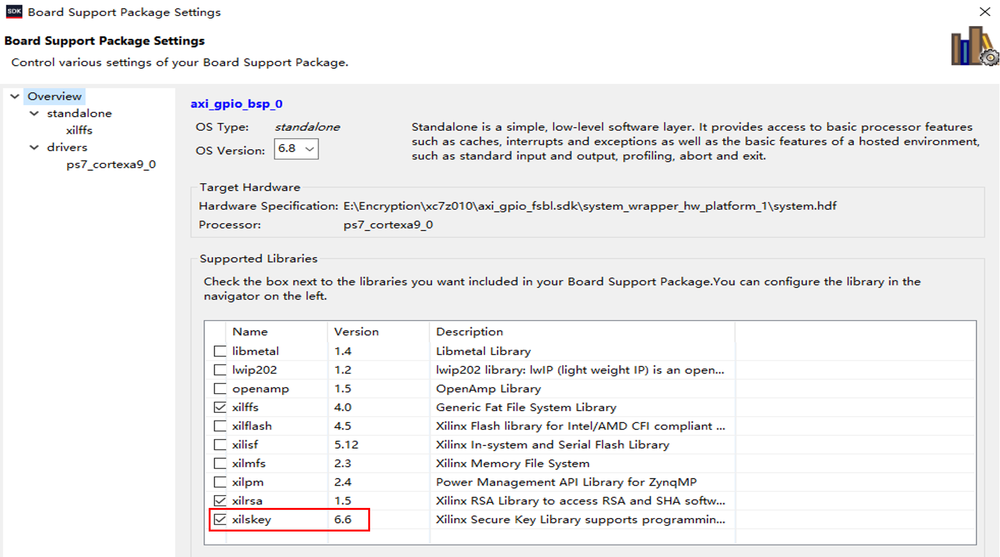

在 BSP Settings 的 Supported Libraries 中勾选 `xilskey`，使 eFUSE 烧录应用能够调用 XilSKey 提供的接口和底层 JTAG 编程逻辑。

**步骤 2：导入 eFUSE 示例工程。**

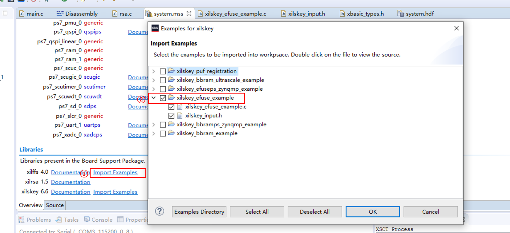

在 `system.mss` 中点击 **Import Examples**，选择 `xilskey_efuse_example` 并导入。SDK 会生成示例源码和 `xilskey_input.h` 配置文件，后续修改主要集中在该头文件中。

**步骤 3：配置 `xilskey_input.h`。**

下面的代码块列出本例涉及的控制项名称：

```c
#define XSK_EFUSEPL_DRIVER
/* #define XSK_EFUSEPS_DRIVER */

#define XSK_EFUSEPL_PROGRAM_AES_AND_USER_LOW_KEY  TRUE
#define XSK_EFUSEPL_DISABLE_AES_KEY_READ           TRUE
#define XSK_EFUSEPL_DISABLE_USER_KEY_READ          TRUE
#define XSK_EFUSEPL_BBRAM_KEY_DISABLE              TRUE
```

**配置 1：选择 PL eFUSE 驱动。**

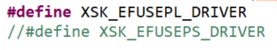

定义 `XSK_EFUSEPL_DRIVER` 表示本例操作 PL eFUSE；如果不需要烧录 PS eFUSE，则保持 `XSK_EFUSEPS_DRIVER` 未启用。

**配置 2：写入与 NKY 一致的 AES Key。**

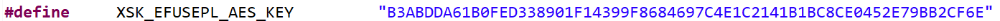

将用于生成加密 `BOOT.bin` 的 AES Key 填入 `XSK_EFUSEPL_AES_KEY`。该值必须与 NKY 中的 `Key 0` 完全一致，否则器件无法正确解密镜像。

**配置 3：启用 AES Key 烧录。**

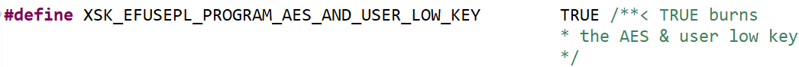

将 `XSK_EFUSEPL_PROGRAM_AES_AND_USER_LOW_KEY` 设为 `TRUE`，示例程序才会执行 AES Key 和 User Low Key 的烧录流程。

**配置 4：按产品要求设置读保护。**

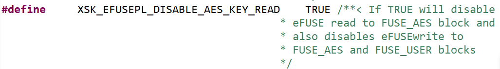

将 `XSK_EFUSEPL_DISABLE_AES_KEY_READ` 设为 `TRUE`，会同时设置对应的 AES Key 读保护控制位，使后续软件不能再直接读取该密钥。

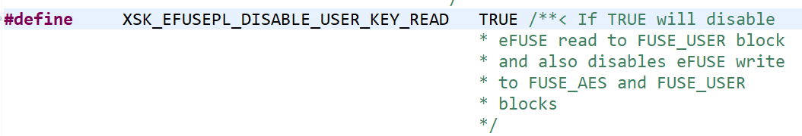

将 `XSK_EFUSEPL_DISABLE_USER_KEY_READ` 设为 `TRUE`，用于关闭 User Key/User Code 的读取能力；是否启用取决于产品是否使用这一区域。

**配置 5：选择安全启动使用的密钥源。**

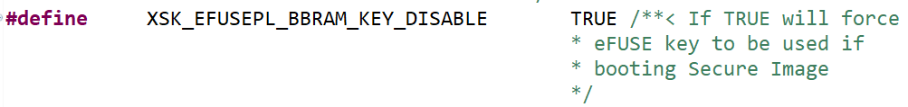

将 `XSK_EFUSEPL_BBRAM_KEY_DISABLE` 设为 `TRUE`，表示安全启动时使用 eFUSE Key，而不再允许使用 BBRAM Key。

**配置 6：按照原理图填写 MIO/JTAG 映射。**

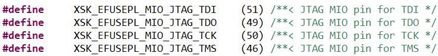

按照板卡原理图填写 `TDI`、`TDO`、`TCK` 和 `TMS` 对应的 MIO 编号。图中的 51、49、50、46 只对应原验证板，移植时必须重新核对连线。

**步骤 4：生成并部署 eFUSE 烧录镜像。**


将 FSBL、Bitstream 和 XilSKey eFUSE 示例应用加入独立的启动镜像，使用 Bootgen 生成专门执行密钥烧录的 `eFUSE_BOOT.bin`。这个镜像的用途是启动烧录程序，不是最终产品固件。

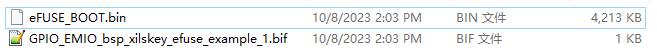

输出目录中的 `eFUSE_BOOT.bin` 是可写入 SD、QSPI 等启动介质的烧录镜像，旁边的 BIF 文件记录其分区组成，便于复核和重复构建。

**步骤 5：启动烧录程序并检查状态。**

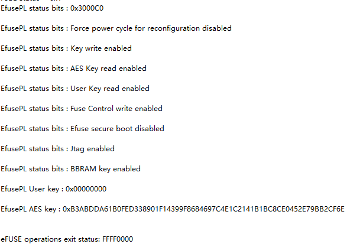

烧录程序启动后会通过串口打印 PL eFUSE 状态，包括密钥写入、读取控制、Secure Boot、JTAG 和 BBRAM Key 等状态。图中状态为 `AES Key read enabled`，因此还能显示本次演示写入的完整 AES Key；如果后续烧录了 AES Key 读保护位，则应以状态位和匹配镜像成功启动进行验证，而不能再依赖读回密钥。

这些宏和位定义可能随 BSP 版本变化。烧录程序必须依据当前 `xilskey` 头文件、器件勘误和官方指南复核，不能仅凭旧项目截图操作。

### 5.5 第四步：将 BOOT.bin 写入 QSPI

**步骤 1：打开 Program Flash Memory 并配置写入参数。**

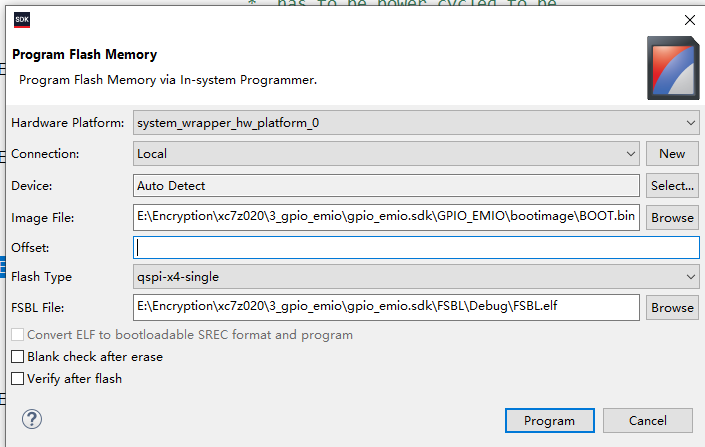

在 **Program Flash Memory** 中选择最终的 `BOOT.bin`，指定与硬件平台匹配的 FSBL，并按板卡 Flash 连接方式选择 QSPI 类型。点击 **Program** 后将镜像写入启动 Flash。

写入完成后，将启动模式设置为 QSPI。此时先不要依靠 JTAG 直接加载加密 Bitstream，下一步通过完整断电重启验证 BootROM、FSBL 和 PL eFUSE 共同组成的启动链。

### 5.6 第五步：断电重启并验证安全启动

**步骤 1：完全断电后重新上电，并观察 FSBL 日志。**

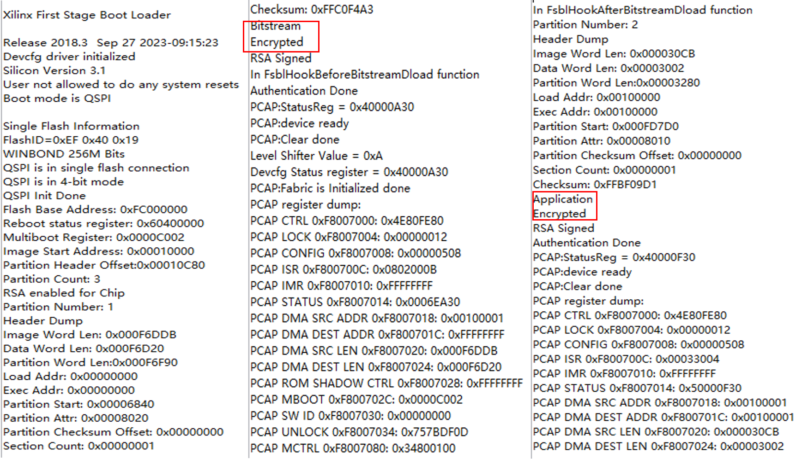

重新上电后，FSBL 日志应显示正确的 QSPI 启动模式和分区数量。图中红框标出的 `Bitstream Encrypted` 与 `Application Encrypted` 表明这两个分区按照加密属性进入了解密加载流程；若同时启用 RSA，还会出现 `RSA Signed` 和 `Authentication Done` 等认证结果。日志是流程观察结果，最终还应结合错误密钥和篡改镜像的负向测试确认防护是否生效。

**步骤 2：完成正向和负向验证。**

- 正确的 `BOOT.bin` 应能完成 FSBL、Bitstream 和应用程序加载；
- 使用错误 AES Key 生成的镜像应无法正常启动；
- 修改加密镜像内容后，HMAC 校验应失败；
- 未烧录匹配 eFUSE Key 的另一块 Zynq 器件不应能运行该加密镜像。

完成判据不是只看到一次 `Encrypted` 日志，而是正确镜像能够启动，同时错误密钥、被修改镜像和未授权器件均无法通过验证。

### 5.7 补充：Multiboot 镜像地址约束

对于 Multiboot，XAPP1175 要求 update image 和 golden image 的地址位于 32 KB 的整数倍。这个要求不能泛化成“所有 QSPI 认证镜像都必须固定放在 32 KB 偏移”。镜像位置应按具体启动模式、BIF 和官方文档设计。

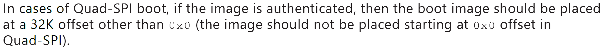

这张图说明的是 Multiboot 场景下 update image 与 golden image 的地址对齐要求。只有采用相应 Multiboot 布局时才需要按 32 KB 整数倍规划镜像地址，普通单镜像启动不能直接套用该偏移结论。

## 6. eFUSE 控制位的风险

Zynq-7000 的部分 eFUSE 控制位具有永久效果：

- **eFUSE Secure Boot / Force Use AES Only**：强制器件使用 eFUSE AES 密钥进行安全启动；
- **BBRAM Key Disable**：安全启动时禁止使用 BBRAM 密钥；
- **JTAG Chain Disable**：永久禁用 Arm DAP 与 PL TAP；
- **RSA Authentication Enable**：启用 RSA 认证启动流程；
- **DFT Mode/JTAG Disable**：永久关闭相关测试能力。

根据 UG585，某些 JTAG、DFT 或强制安全启动位一旦烧录，会影响 AMD 的 RMA 测试能力。控制位的具体作用和组合关系应以 [UG585：PL eFUSE Settings](https://docs.amd.com/r/en-US/ug585-zynq-7000-SoC-TRM/PL-eFUSE-Settings) 与 [UG585：PS eFUSE Settings](https://docs.amd.com/r/en-US/ug585-zynq-7000-SoC-TRM/PS-eFUSE-Settings) 为准。

推荐的量产顺序是：验证普通启动 → 验证安全镜像 → 烧录 AES Key/PPK Hash → 再次验证安全启动 → 烧录读保护与强制安全位 → 最后评估并关闭 JTAG/DFT → 归档设备、密钥和镜像哈希。

把不可逆控制位放到流程最后，可以降低因密钥、镜像或板级电源问题导致整批器件失效的风险。

## 7. 量产安全检查表

### 构建环境

- [ ] 私钥、AES/HMAC 密钥不进入源码仓库；
- [ ] 签名工作站与普通开发环境隔离；
- [ ] 每次发布保存 BIF、Bootgen 版本、BOOT.bin 哈希和公开证书；
- [ ] 构建日志不打印密钥或完整 `.nky` 内容；
- [ ] 至少两人复核量产密钥文件和器件型号。

### 器件烧录

- [ ] 器件电源、电压、温度和 JTAG/MIO 连接满足编程要求；
- [ ] 在专用样片上完整跑通一次流程；
- [ ] 先烧录密钥，再验证启动，最后烧录限制性控制位；
- [ ] 烧录后读取允许读取的状态位并记录；
- [ ] 使用正确、错误和被篡改镜像进行正向与负向测试。

### 产品生命周期

- [ ] 定义密钥泄露后的处置方案；
- [ ] 定义安全升级、掉电恢复和 Golden Image 方案；
- [ ] 明确 JTAG 永久关闭后如何进行故障诊断；
- [ ] 评估共享密钥失陷对整批设备的影响。

## 8. 安全边界

Zynq-7000 安全启动可以显著提高镜像复制、离线逆向和恶意替换的难度，但它不是完整的产品安全体系。以下问题仍需系统级设计：

- Linux、U-Boot 和应用程序的运行时漏洞；
- 网络升级服务和运维账户安全；
- 私钥或 AES 密钥在构建环境中的泄露；
- 侧信道、故障注入和高成本物理攻击；
- 启动失败后的恢复和审计。

真正可靠的方案应把器件安全启动、签名基础设施、生产烧录、升级协议和软件漏洞管理放在同一套信任模型中考虑。

## 9. 参考资料

- [UG585 — Zynq-7000 SoC Technical Reference Manual](https://docs.amd.com/r/en-US/ug585-zynq-7000-SoC-TRM/Device-Secure-Boot)
- [UG821 — Zynq-7000 SoC Software Developers Guide](https://docs.amd.com/r/en-US/ug821-zynq-7000-swdev/Boot-and-Configuration)
- [XAPP1175 — Secure Boot of Zynq-7000 SoC](https://docs.amd.com/v/u/en-US/xapp1175_zynq_secure_boot)
