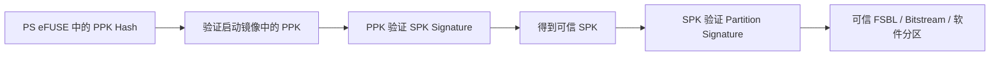
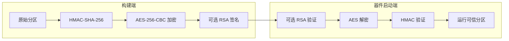
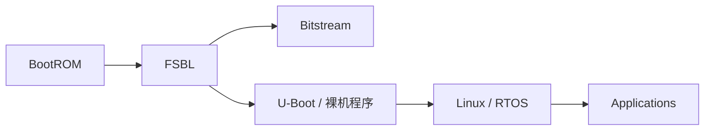
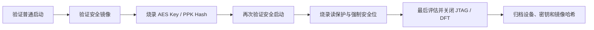

# Zynq-7000 安全启动与防护策略：AES、RSA 与 eFUSE 部署

在基于 Zynq-7000 的产品中，攻击者拿到整机后，通常可以直接接触 PCB、启动 Flash、调试接口和软件镜像。如果系统没有建立可信启动链，仅依靠“代码不公开”很难长期保护 FPGA 逻辑和软件资产。

Zynq-7000 提供 AES-256-CBC 加密、HMAC-SHA-256 完整性校验、RSA-2048 公钥认证，以及 eFUSE、BBRAM 等片上密钥存储机制。合理组合这些能力，可以提高抄板、镜像逆向、恶意篡改和未授权固件运行的门槛。

本文先梳理各类安全机制的职责，再说明密钥、启动镜像和 eFUSE 的部署流程。文末的 GUI 操作以 Vivado/SDK 2018.3 为背景，新版工具的菜单位置可能不同，但安全架构和密钥管理原则不变。

> **重要提醒：** eFUSE 是一次性资源。错误烧录 AES 密钥、安全启动位或 JTAG 禁用位，可能造成器件永久无法启动、无法调试，并影响返修。量产前必须在专用测试器件上验证完整流程，控制位应在功能验证完成后最后烧录。

## 1. 先明确要防什么

常见风险可以分为以下几类：

| 风险 | 攻击方式 | 主要防护目标 | Zynq-7000 对应能力 |
| --- | --- | --- | --- |
| 产品克隆 | 抄板并复制外部 Flash | 让复制的镜像无法在未授权器件上运行 | 片上 AES 密钥、eFUSE 或 BBRAM |
| 软件破解 | 读取 Flash，分析 FSBL、Bitstream 和应用程序 | 保护镜像机密性 | AES-256-CBC 加密 |
| 软件篡改 | 替换启动分区或注入恶意镜像 | 验证镜像来源和完整性 | RSA-2048 认证 |
| 调试接口滥用 | 通过 JTAG、DAP 或测试模式读取和控制器件 | 限制生产设备调试入口 | JTAG/DFT 相关 eFUSE 控制位 |
| 固件回滚 | 替换成签名合法但存在旧漏洞的版本 | 保证版本新鲜度 | 需要系统自行设计版本策略 |

这里必须区分三个概念：

- **AES 加密**解决的是机密性问题，让攻击者无法直接读取镜像原文；
- **HMAC**用于加密镜像的对称完整性校验，Zynq-7000 的 AES 和 HMAC 引擎在安全解密流程中配合使用；
- **RSA 认证**解决镜像来源和公钥信任问题，适合建立从 BootROM 到后续分区的公钥信任链。

因此，不能简单地认为“使用 AES 就等于完成安全启动”。如果产品要求只有厂家签发的镜像才能运行，或要支持安全升级，应该同时评估 RSA 认证。AMD 官方资料列出的 Zynq-7000 安全启动能力包括 AES-CBC 256 bit、HMAC-SHA-256 和 RSA 2048 bit，具体选择取决于产品威胁模型。[UG821：Secure Boot Support](https://docs.amd.com/r/en-US/ug821-zynq-7000-swdev/Secure-Boot-Support)

## 2. Zynq-7000 的安全资源

### 2.1 AES 密钥：PL eFUSE 与 BBRAM

Zynq-7000 的 AES 密钥存放在 PL 侧，可选择 eFUSE 或 BBRAM 作为密钥源。

| 密钥存储 | 特点 | 适用场景 |
| --- | --- | --- |
| BBRAM | 易失，需要电池维持；密钥可清除和重新写入 | 开发验证、需要密钥可撤销的设备 |
| PL eFUSE | 非易失、一次性烧录，不依赖电池 | 流程成熟后的量产设备 |

两种密钥源必须与 Boot Image Header 中的加密状态匹配。使用 eFUSE 密钥的加密镜像和使用 BBRAM 密钥的加密镜像具有不同的 Header 标识；配置不匹配可能触发安全锁定。[UG585：Boot Image Header](https://docs.amd.com/r/en-US/ug585-zynq-7000-SoC-TRM/Boot-Image-Header)

对于抗克隆设计，还要决定使用“全产品共享密钥”还是“每台设备独立密钥”：

- 共享密钥便于生产和统一发布镜像，但一旦密钥泄露，影响范围可能覆盖整批设备；
- 每台设备独立密钥可以缩小单点泄露影响，但需要逐设备生成镜像或设计安全的个性化生产流程。

### 2.2 RSA 根信任：PS eFUSE

RSA 认证使用两级密钥体系：

- PPK：Primary Public Key，主公钥；
- PSK：Primary Secret Key，主私钥；
- SPK：Secondary Public Key，次公钥；
- SSK：Secondary Secret Key，次私钥。

器件的 PS eFUSE 保存 PPK 的 SHA-256 哈希值，而不是私钥。启动镜像中携带 PPK、SPK、SPK 签名和分区签名。验证关系如下：



主私钥 PSK 和次私钥 SSK 只能保存在受控签名环境中，不能写入启动镜像、源码仓库或生产设备。PPK/SPK 的完整结构和认证证书格式可参考 [UG821：Authentication Overview](https://docs.amd.com/r/en-US/ug821-zynq-7000-swdev/Authentication-Overview) 与 [UG821：Authentication Certificate](https://docs.amd.com/r/en-US/ug821-zynq-7000-swdev/Authentication-Certificate)。

### 2.3 硬件安全模块

安全启动涉及的主要硬件资源包括：

- **BootROM**：片上只读启动代码，负责最早期的启动与安全状态判断；
- **OCM**：片上存储器，BootROM 将 FSBL 加载到这里执行；
- **AES Decryptor**：PL 内的 AES-256 解密引擎；
- **HMAC Engine**：使用 SHA-256 的消息认证引擎；
- **PL eFUSE/BBRAM**：存放 AES 密钥；
- **PS eFUSE**：存放 PPK Hash 及 RSA、DFT 等安全控制位；
- **NVM Controller**：访问 QSPI、NAND、NOR、SD 等启动介质。

Zynq-7000 的主安全启动会使用 PL 内的 AES/HMAC 硬核，因此解密期间 PL 必须处于供电状态。[UG585：Master Secure Boot](https://docs.amd.com/r/en-US/ug585-zynq-7000-SoC-TRM/Master-Secure-Boot)

## 3. 加密、认证和镜像结构

### 3.1 AES/HMAC 的处理顺序

在 Bootgen 侧，软件分区先生成 HMAC，再进行 AES 加密；在器件侧则以相反方向处理：先进行 RSA 认证（若启用），再进行 AES 解密，最后验证 HMAC。AES 会同时包裹分区数据、HMAC 签名和 HMAC 密钥。[XAPP1175：Secure Boot of Zynq-7000 SoC](https://docs.amd.com/v/u/en-US/xapp1175_zynq_secure_boot)



### 3.2 哪些分区需要保护

典型 Zynq 系统可能包含：

1. FSBL；
2. PL Bitstream；
3. U-Boot 或裸机程序；
4. Linux Kernel、Device Tree、RootFS；
5. 应用程序与配置数据。

要保护链路后端的某个组件，前面的加载器也必须可信。只给应用程序签名，却让未认证的 U-Boot 负责加载它，攻击者仍可能替换 U-Boot 绕过检查。



每个箭头都代表一次信任传递。安全策略不一定要求所有分区都加密，但负责加载和验证后级组件的代码必须位于可信链中。

## 4. 安全启动流程

Zynq-7000 的安全启动可以按职责划分为三个阶段。

### 4.1 Stage 0：BootROM

1. 系统上电后执行片上 BootROM；
2. BootROM 从 QSPI、SD 等启动设备读取 Boot Header；
3. 将 FSBL 装载到 OCM；
4. 若启用 RSA，先依据 PS eFUSE 中的 PPK Hash 验证 FSBL 认证证书；
5. 若 FSBL 被加密，调用 PL 侧 AES/HMAC 引擎完成解密和完整性校验；
6. 验证成功后跳转到 FSBL。

### 4.2 Stage 1：FSBL

FSBL 根据分区属性处理 Bitstream、U-Boot 或裸机程序：

- 对需要 RSA 认证的分区验证认证证书；
- 对需要 AES 加密的分区完成解密和 HMAC 校验；
- 将 Bitstream 配置到 PL；
- 将软件分区装载到 OCM 或 DDR；
- 将控制权交给下一阶段。

Bootgen 根据 BIF 描述生成 Boot Header、分区表和分区数据。每个分区可以单独配置加密与认证属性。[UG821：Boot Image Creation](https://docs.amd.com/r/en-US/ug821-zynq-7000-swdev/Boot-Image-Creation)

### 4.3 Stage 2：U-Boot、操作系统和应用

从 U-Boot 开始，后续镜像的验证通常由软件负责。Linux 应用、升级包和配置文件是否继续验证，取决于系统自己的启动脚本、密钥管理和更新协议。

安全启动只能保证“从受信任根开始执行经过验证的代码”，不能自动消除运行时漏洞，也不会自动阻止已签名旧固件回滚。产品仍需设计版本号、升级策略、异常恢复和日志审计。

## 5. Vivado/SDK 2018.3 实战流程

原始验证环境如下：

- Vivado/SDK 2018.3；
- XC7Z020CLG400-2；
- Windows 10；
- 启动介质为 QSPI；
- 加密对象为 FSBL、Bitstream 和裸机应用。

以下步骤用于说明旧版 SDK 工程的完整关系。正式量产时应以当前器件、工具版本和 AMD 官方文档为准。

### 5.1 准备 FSBL

1. 在 Vivado 中完成硬件设计并导出 `system_wrapper.hdf`；
2. 在 SDK 中导入硬件平台；
3. 创建 Zynq FSBL 工程及 BSP；
4. 如果使用 RSA，在 FSBL 编译符号中启用对应的 RSA 支持；
5. 调试阶段可以打开 FSBL 日志，但量产版本不应输出密钥或敏感安全状态。

原工程使用过以下调试与 RSA 相关宏：

```text
DEBUG
FSBL_DEBUG_GENERAL
FSBL_DEBUG_INFO
RSA_SUPPORT
```

宏名称和启用方式与具体 SDK 版本有关，升级工具后应重新核对 FSBL 文档。

### 5.2 使用 BIF 和 Bootgen 生成安全镜像

推荐将安全属性写入 BIF 文件并纳入受控构建流程。以下是结构示例，路径和密钥文件名仅为占位符：

```bif
the_ROM_image:
{
    [aeskeyfile] keys/device_key.nky
    [pskfile] keys/primary_secret.pem
    [sskfile] keys/secondary_secret.pem

    [bootloader, encryption=aes, authentication=rsa] fsbl.elf
    [encryption=aes, authentication=rsa] system.bit
    [authentication=rsa] app.elf
}
```

生成命令示例：

```bash
bootgen -arch zynq -image secure.bif -w -o BOOT.bin
```

Bootgen 可以生成 `.nky`、RSA 密钥和签名中间文件，也支持离线签名流程。官方命令参数见 [UG821：Bootgen Command Options](https://docs.amd.com/r/en-US/ug821-zynq-7000-swdev/Bootgen-Command-Options)。

> `.nky`、PSK、SSK 和任何串口打印出的 AES/HMAC 内容都属于秘密材料。不要提交到 Git、网盘公开目录或普通构建日志。建议将密钥生成与固件构建分离，并限制签名工作站访问权限。

### 5.3 先用可恢复方案验证

在烧录 eFUSE 前，建议按以下顺序验证：

1. 确认非安全 BOOT.bin 可以稳定启动；
2. 在专用开发板上使用 BBRAM 或测试密钥验证加密镜像；
3. 验证断电、错误镜像、镜像替换和升级回退场景；
4. 确认量产 BOOT.bin 与待烧录密钥完全匹配；
5. 备份构建输入、哈希、公开证书和设备序列号之间的映射；
6. 最后才进入 eFUSE 量产烧录。

### 5.4 使用 XilSKey 烧录 eFUSE

旧版 SDK 的 `xilskey` 库提供 eFUSE 编程示例。原工程采用 MIO 模拟 JTAG 链路，示例连接如下：

| MIO | JTAG 信号 |
| ---: | --- |
| 51 | TDI |
| 49 | TDO |
| 50 | TCK |
| 46 | TMS |

该映射只适用于对应板卡和原理图，不能直接复制到其他硬件。MIO 选择还必须避开上电阶段具有特殊启动功能的引脚。

典型软件准备包括：

1. 在 BSP 中加入 `xilskey` 库；
2. 导入 Zynq eFUSE 编程示例；
3. 在 `xilskey_input.h` 中按需求启用 PL 或 PS eFUSE 驱动；
4. 通过安全方式向烧录程序注入 AES 密钥；
5. 配置 MIO 与 JTAG 信号映射；
6. 先读取并核对器件状态，再执行一次性烧录；
7. 烧录后立即验证密钥状态和安全镜像启动结果。

严禁在源码中提交真实密钥。下面只展示控制项名称，不包含任何密钥值：

```c
#define XSK_EFUSEPL_DRIVER
/* #define XSK_EFUSEPS_DRIVER */

#define XSK_EFUSEPL_PROGRAM_AES_AND_USER_LOW_KEY  TRUE
#define XSK_EFUSEPL_DISABLE_AES_KEY_READ           TRUE
#define XSK_EFUSEPL_DISABLE_USER_KEY_READ          TRUE
#define XSK_EFUSEPL_BBRAM_KEY_DISABLE              TRUE
```

这些宏和位定义可能随 BSP 版本变化。烧录程序必须依据当前 `xilskey` 头文件、器件勘误和官方指南复核，不能仅凭旧项目截图操作。

### 5.5 烧录 BOOT.bin 并验证

1. 将与器件 AES 密钥匹配的 BOOT.bin 写入 QSPI；
2. 设置正确的启动模式；
3. 完全断电后重新上电；
4. 观察 FSBL 串口日志和各分区加载状态；
5. 使用错误密钥镜像、被修改镜像和未加密镜像做负向测试；
6. 确认安全失败时系统进入预期状态，而不是继续执行未验证代码。

对于 Multiboot，XAPP1175 要求 update image 和 golden image 的地址位于 32 KB 的整数倍。这个要求不能泛化成“所有 QSPI 认证镜像都必须固定放在 32 KB 偏移”。镜像位置应按具体启动模式、BIF 和官方文档设计。

## 6. eFUSE 控制位的风险

Zynq-7000 的部分 eFUSE 控制位具有永久效果：

- **eFUSE Secure Boot / Force Use AES Only**：强制器件使用 eFUSE AES 密钥进行安全启动；
- **BBRAM Key Disable**：安全启动时禁止使用 BBRAM 密钥；
- **JTAG Chain Disable**：永久禁用 Arm DAP 与 PL TAP；
- **RSA Authentication Enable**：启用 RSA 认证启动流程；
- **DFT Mode/JTAG Disable**：永久关闭相关测试能力。

根据 UG585，某些 JTAG、DFT 或强制安全启动位一旦烧录，会影响 AMD 的 RMA 测试能力。控制位的具体作用和组合关系应以 [UG585：PL eFUSE Settings](https://docs.amd.com/r/en-US/ug585-zynq-7000-SoC-TRM/PL-eFUSE-Settings) 与 [UG585：PS eFUSE Settings](https://docs.amd.com/r/en-US/ug585-zynq-7000-SoC-TRM/PS-eFUSE-Settings) 为准。

推荐的量产顺序是：



把不可逆控制位放到流程最后，可以降低因密钥、镜像或板级电源问题导致整批器件失效的风险。

## 7. 量产安全检查表

### 构建环境

- [ ] 私钥、AES/HMAC 密钥不进入源码仓库；
- [ ] 签名工作站与普通开发环境隔离；
- [ ] 每次发布保存 BIF、Bootgen 版本、BOOT.bin 哈希和公开证书；
- [ ] 构建日志不打印密钥或完整 `.nky` 内容；
- [ ] 至少两人复核量产密钥文件和器件型号。

### 器件烧录

- [ ] 器件电源、电压、温度和 JTAG/MIO 连接满足编程要求；
- [ ] 在专用样片上完整跑通一次流程；
- [ ] 先烧录密钥，再验证启动，最后烧录限制性控制位；
- [ ] 烧录后读取允许读取的状态位并记录；
- [ ] 使用正确、错误和被篡改镜像进行正向与负向测试。

### 产品生命周期

- [ ] 定义密钥泄露后的处置方案；
- [ ] 定义固件版本和回滚策略；
- [ ] 定义安全升级、掉电恢复和 Golden Image 方案；
- [ ] 明确 JTAG 永久关闭后如何进行故障诊断；
- [ ] 评估共享密钥失陷对整批设备的影响。

## 8. 安全边界

Zynq-7000 安全启动可以显著提高镜像复制、离线逆向和恶意替换的难度，但它不是完整的产品安全体系。以下问题仍需系统级设计：

- Linux、U-Boot 和应用程序的运行时漏洞；
- 网络升级服务和运维账户安全；
- 私钥或 AES 密钥在构建环境中的泄露；
- 侧信道、故障注入和高成本物理攻击；
- 已签名旧版本的回滚；
- 启动失败后的恢复和审计。

真正可靠的方案应把器件安全启动、签名基础设施、生产烧录、升级协议和软件漏洞管理放在同一套信任模型中考虑。

## 9. 参考资料

- [UG585 — Zynq-7000 SoC Technical Reference Manual](https://docs.amd.com/r/en-US/ug585-zynq-7000-SoC-TRM/Device-Secure-Boot)
- [UG821 — Zynq-7000 SoC Software Developers Guide](https://docs.amd.com/r/en-US/ug821-zynq-7000-swdev/Boot-and-Configuration)
- [XAPP1175 — Secure Boot of Zynq-7000 SoC](https://docs.amd.com/v/u/en-US/xapp1175_zynq_secure_boot)
- [UG821 — Bootgen Command Options](https://docs.amd.com/r/en-US/ug821-zynq-7000-swdev/Bootgen-Command-Options)
